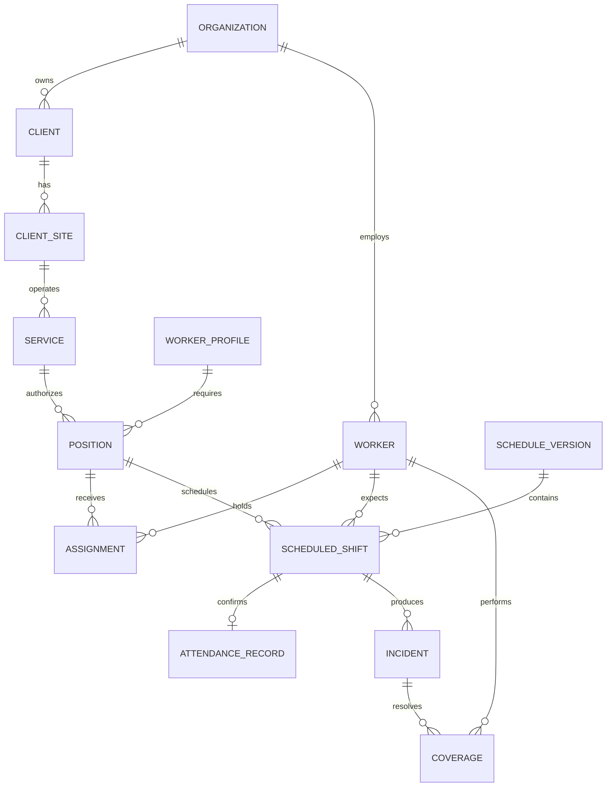

# Plan maestro de GestIA

- Versión: 1.2
- Fecha de actualización: 2026-08-27
- Estado: documento rector de planeación

## 1. Propósito

GestIA será una plataforma para centralizar la gestión comercial y operativa de servicios con personal asignado. Debe conectar, sin duplicar capturas, el recorrido completo desde la solicitud de un cliente hasta la planeación, asistencia, atención de incidencias, cobertura y generación de reportes.

Este documento concentra:

- La visión y el alcance del producto.
- Las decisiones técnicas confirmadas.
- El orden previsto de desarrollo.
- El bosquejo evolutivo de la base de datos SQL Server.
- Las reglas para cambiar el modelo conforme aparezca nueva información.
- El trabajo terminado y el trabajo pendiente.

Los ADR dentro de `docs/adr` siguen siendo la evidencia de decisiones técnicas específicas. En caso de contradicción, se debe actualizar este documento y el ADR correspondiente en el mismo cambio.

## 2. Estado general

### Terminado

- Repositorio único para backend, frontend, documentación y contenedores.
- Backend ASP.NET Core sobre .NET 10.
- Capas `Domain`, `Application`, `Infrastructure` y `Api`.
- Pruebas automáticas de dependencias entre capas.
- Angular 22 con TypeScript estricto.
- Shell visual adaptado de INSPINIA 5.
- Navegación responsive y pantalla de inicio.
- SQL Server configurado mediante EF Core 10.
- `GestIaDbContext`, convenciones obligatorias y fábrica de migraciones.
- Análisis de contrato, carta de inicio y ficha técnica para clientes, servicios y empleados.
- Primer modelo físico de 11 tablas con auditoría, borrado lógico, integridad e índices.
- Primera migración SQL Server del modelo de negocio.
- Módulo inicial de organizaciones con alta y consulta.
- Primer recorrido vertical de clientes con alta, consulta paginada, búsqueda, edición y baja lógica.
- DTO, validaciones de entrada, detección de duplicados y Problem Details en la API.
- Pantalla Angular de clientes integrada con la API y el contexto de organización.
- Autenticación JWT local para MVP con login, usuario administrador bootstrap, permisos base y rutas protegidas.
- SQL Server 2025 Developer, API y frontend integrados con Docker Compose.
- Health checks de proceso, SQL Server, API y frontend.
- Nginx como servidor del frontend y proxy de `/api`.
- Pipeline CI para pruebas, builds e imágenes de contenedor.
- Documentos iniciales de arquitectura, despliegue y modelo.

### Todavía no desarrollado

- Recuperación de acceso, refresh token y administración completa de sesión.
- Administración funcional de usuarios, roles, permisos y alcance por empresa.
- Catálogos y CRUD funcionales adicionales al primer módulo de clientes.
- Endpoints y pantallas para sedes, contactos, servicios y contratos.
- Endpoints y pantallas para empleados, documentos, evaluaciones y asignaciones.
- Solicitudes, posiciones, patrones de turno y planeación detallada.
- Planeación versionada y publicación.
- Asistencia, incidencias, coberturas y evidencias.
- Auditoría funcional consultable.
- Dashboard y reportes con datos reales.
- Importaciones, exportaciones e integraciones externas.
- Observabilidad, respaldo y despliegue productivo.

## 3. Decisiones confirmadas

| Área | Decisión |
| --- | --- |
| Backend | .NET 10, ASP.NET Core y C# 14 |
| Frontend | Angular 22, TypeScript, SCSS y Tailwind integrado desde INSPINIA 5 |
| Arquitectura | Monolito modular con capas limpias |
| API | REST/JSON con OpenAPI versionado |
| Base de datos | Microsoft SQL Server mediante EF Core 10 |
| Desarrollo local | Docker Compose con SQL Server 2025 Developer |
| Pruebas backend | xUnit |
| Pruebas frontend | Vitest |
| Identificadores | Identificadores técnicos independientes del nombre visible |
| Tiempo | Instantes en UTC; fechas de negocio conservadas por separado |
| Historial | Los cambios operativos importantes deben ser auditables |
| Multiempresa | El servidor debe aplicar aislamiento y permisos |

## 4. Arquitectura objetivo

```text
Angular / INSPINIA
        |
        | HTTPS + REST/JSON
        v
ASP.NET Core API
        |
        v
Application: casos de uso y contratos
        |
        v
Domain: reglas, agregados, valores y eventos
        ^
        |
Infrastructure: EF Core, SQL Server, identidad e integraciones
        |
        v
Microsoft SQL Server
```

### Reglas entre capas

```text
Domain          -> no depende de otras capas de GestIA
Application     -> depende de Domain
Infrastructure  -> depende de Application + Domain
Api             -> depende de Application + Infrastructure
Frontend        -> consume contratos HTTP; no referencia código .NET
```

- Domain no conoce EF Core, SQL Server, controladores ni Angular.
- Application coordina casos de uso, validaciones y autorización funcional.
- Infrastructure implementa persistencia e integraciones.
- Api expone endpoints, autenticación, middleware y OpenAPI.
- Angular no será la autoridad de reglas que deban protegerse en el servidor.
- No se creará un proyecto por cada tabla.
- No se agregarán librerías de mediator o mapeo sin necesidad demostrada.

## 5. Módulos funcionales previstos

Los nombres son provisionales hasta validar el glosario del negocio.

### Plataforma

- Empresas u organizaciones.
- Zonas y configuración operativa.
- Usuarios, membresías, roles y permisos.
- Auditoría y eventos pendientes de integración.

### Comercial

- Clientes, razones sociales, sedes y contactos.
- Solicitudes de servicio.
- Conversión de solicitud a servicio aceptado.
- Vigencias y condiciones necesarias para operar.

### Personal

- Personas operativas o empleados.
- Perfiles, habilidades, requisitos y documentos.
- Disponibilidad, estatus, zona y elegibilidad.

### Operación

- Servicios activos.
- Posiciones autorizadas por servicio.
- Patrones y segmentos de turno.
- Asignaciones con vigencia e histórico.
- Planeación versionada.

### Ejecución

- Turnos programados.
- Asistencia esperada y asistencia real.
- Incidencias, motivos, impacto y seguimiento.
- Coberturas, sustitutos e intervalos cubiertos.
- Evidencias y referencias de almacenamiento.

### Control e información

- Autorizaciones.
- Auditoría consultable.
- Dashboard operativo.
- Reportes y exportaciones.
- Proyecciones de lectura reconstruibles.
- Prenómina y cumplimiento como módulos posteriores.

## 6. Flujo funcional principal

```text
Solicitud de servicio
  -> cliente y sede
  -> servicio aceptado
  -> posiciones requeridas
  -> patrones de turno
  -> asignación de personal
  -> planeación publicada
  -> asistencia real
  -> incidencia, si existe excepción
  -> cobertura y autorización
  -> auditoría, dashboard y reporte
```

Una captura confirmada deberá reutilizarse en los procesos posteriores. Los reportes no reconstruirán relaciones mediante nombres o textos visibles.

## 7. Modelo evolutivo de SQL Server

### 7.1 Estado del modelo

Está confirmado el motor SQL Server. Todavía son provisionales:

- El nombre productivo de la base de datos.
- Los esquemas físicos.
- Los nombres finales de tablas y columnas.
- La separación exacta entre empresa, organización, razón social y sucursal.
- Los catálogos, estados y reglas de obligatoriedad.
- Longitudes, precisiones e índices finales.
- Varias relaciones y reglas de eliminación.

La nomenclatura de base ya está aprobada: `db-gestia-dev`, `db-gestia-qa`, `db-gestia-beta`, `db-gestia-staging` y `db-gestia` para producción. No se generará una migración masiva basándose sólo en este bosquejo.

### 7.2 Convenciones obligatorias

| Uso | SQL Server propuesto | Nota |
| --- | --- | --- |
| Identificador técnico | `uniqueidentifier` | Generado por la aplicación |
| Fecha de negocio | `date` | Sin zona horaria |
| Instante | `datetime2(0)` | Almacenado en UTC |
| Texto | `nvarchar(n)` | Longitud explícita por dato |
| Texto amplio | `nvarchar(max)` | Sólo cuando exista justificación |
| Importe | `decimal(19,4)` | Precisión por confirmar |
| Horas o duración | `decimal(9,4)` o intervalo derivado | Validar por proceso |
| Estado | Código estable | Nunca depender sólo del texto visible |
| Concurrencia | `rowversion` | Para actualizaciones optimistas |
| JSON | `nvarchar(max)` | Auditoría o integración, no modelo principal |

Campos transversales candidatos:

```text
Id{Entidad} uniqueidentifier PK
IdOrganization uniqueidentifier   -- cuando aplique aislamiento
CreatedAt datetime2(0)
CreatedBy uniqueidentifier
CreatedByName nvarchar(100)
UpdatedAt datetime2(0) null
UpdatedBy uniqueidentifier null
UpdatedByName nvarchar(100) null
Active bit NOT NULL DEFAULT (1)
Version rowversion
```

`Organization` sigue siendo un término funcional provisional, pero cualquier clave física seguirá el patrón `Id{Entidad}`. Todos los campos `At` de auditoría se almacenan en UTC. La norma completa y sus listas de revisión están en `docs/database/DATABASE_STANDARDS.md`.

### 7.3 Esquemas físicos candidatos

| Esquema provisional | Responsabilidad |
| --- | --- |
| `dbo` | Datos transaccionales mientras un módulo no justifique un esquema propio |
| `audit` | Auditoría, trazabilidad e histórico técnico |
| `config` | Configuración y catálogos administrables |
| `report` | Vistas y proyecciones de lectura reconstruibles |
| `archive` | Archivo histórico cuando exista una política aprobada |

Los esquemas son minúsculos y sólo se ampliarán mediante una decisión de arquitectura antes de la migración que los utilice.

### 7.4 Tablas implementadas y candidatas

El primer corte físico implementa `Organizations`, `Clients`, `ClientSites`, `ClientContacts`, `ServiceContracts`, `Services`, `ServiceConfigurations`, `Employees`, `EmployeeDocuments`, `EmployeeEvaluations` y `ServiceAssignments`. Su justificación y mapeo a las fuentes están en `docs/architecture/08-source-model-analysis.md`. Las demás tablas de esta sección continúan como candidatas.

#### Platform

| Tabla de trabajo | Datos candidatos | Estado |
| --- | --- | --- |
| `Organizations` | Nombre, razón social, zona horaria, estado | Por validar |
| `Zones` | Organización, nombre, estado, municipio, zona horaria | Por validar |
| `Users` | Identidad externa/local, correo normalizado, estado | Por validar con autenticación |
| `OrganizationMemberships` | Usuario, organización, vigencia | Por validar |
| `Roles` | Organización opcional, código, nombre, estado | Por validar |
| `Permissions` | Código estable, módulo, descripción | Por validar |
| `RolePermissions` | Rol, permiso | Por validar |
| `UserRoles` | Membresía o usuario, rol, vigencia | Por validar |
| `AuditEvents` | Actor, acción, entidad, antes/después, motivo, origen, correlación | Confirmado conceptualmente |
| `OutboxMessages` | Evento, carga JSON, intentos, fecha de procesamiento | Posterior |

#### Commercial

| Tabla de trabajo | Datos candidatos | Estado |
| --- | --- | --- |
| `Clients` | Organización, nombre comercial, razón social, estado | Por validar |
| `ClientSites` | Cliente, domicilio, zona, contacto, estado | Por validar |
| `ClientContacts` | Sede/cliente, nombre, puesto, teléfono, correo | Por validar privacidad |
| `ServiceRequests` | Cliente, sede, inicio solicitado, cantidad, horario, perfil, estado | Por validar |
| `Services` | Cliente, sede, nombre, tipo, vigencia, estado | Por validar |

#### Workforce

| Tabla de trabajo | Datos candidatos | Estado |
| --- | --- | --- |
| `WorkerProfiles` | Organización, código, nombre, requisitos, estado | Por validar |
| `Workers` | Organización, número, nombre, contacto, zona, disponibilidad, estado | Por validar |
| `WorkerProfileAssignments` | Persona, perfil, vigencia | Por validar |
| `Qualifications` | Tipo, emisor, vigencia, estado | Posterior |
| `WorkerQualifications` | Persona, requisito, documento, vigencia | Posterior |

#### Operations

| Tabla de trabajo | Datos candidatos | Estado |
| --- | --- | --- |
| `Positions` | Servicio, perfil, nombre/código, capacidad, vigencia, estado | Por validar |
| `ShiftPatterns` | Organización, código, nombre, ciclo, estado | Por validar |
| `ShiftSegments` | Patrón, día del ciclo, inicio, fin, trabajo/descanso | Por validar |
| `Assignments` | Posición, persona, patrón, tipo, inicio, fin, origen | Por validar |
| `ScheduleVersions` | Organización, periodo, versión, estado, publicación | Por validar |
| `ScheduledShifts` | Versión, servicio, posición, persona esperada, inicio, fin | Por validar |
| `AttendanceRecords` | Turno, persona esperada, persona real, entrada, salida, fuente, estado | Por validar |
| `Incidents` | Turno, tipo, motivo, impacto, estado, seguimiento | Por validar |
| `Coverages` | Incidencia, sustituto, inicio, fin, estado, autorización | Por validar |
| `EvidenceItems` | Propietario, tipo, hash, ubicación, actor, fecha, privacidad | Por validar |

#### Reporting

| Proyección de trabajo | Propósito | Estado |
| --- | --- | --- |
| `DailyOperationSummary` | Indicadores diarios por organización/servicio | Posterior |
| `ServiceCoverageSummary` | Cobertura por servicio y periodo | Posterior |
| `EffectivePersonnel` | Persona que realmente cubrió un intervalo | Posterior |

Las proyecciones podrán ser vistas o tablas actualizadas por eventos. Nunca serán la fuente transaccional.

### 7.5 Relaciones principales propuestas



### 7.6 Reglas críticas candidatas

- Número de empleado, códigos y claves comerciales serán únicos dentro de su alcance.
- Una posición existe independientemente de la persona que la cubre.
- Asignaciones incompatibles no podrán traslaparse.
- Una versión publicada de planeación será inmutable y se reemplazará por otra versión.
- Existirá una asistencia principal confirmada por turno programado.
- Una cobertura confirmada requerirá sustituto e intervalo válido.
- Una corrección conservará valor anterior, valor nuevo, motivo, actor y fecha.
- Los registros operativos no se eliminarán físicamente durante el flujo normal.
- Las consultas multiempresa aplicarán el alcance autorizado desde la API.
- Los nombres visibles nunca funcionarán como claves foráneas.

### 7.7 Política de migraciones

1. Confirmar el glosario y el escenario de negocio del corte.
2. Aprobar atributos, obligatoriedad, privacidad, longitudes y reglas.
3. Implementar reglas en Domain/Application.
4. Configurar el modelo físico con Fluent API en Infrastructure.
5. Generar la migración EF Core.
6. Revisar el SQL producido, índices, FKs y pérdida potencial de datos.
7. Probar la migración en SQL Server real.
8. Aplicarla mediante despliegue controlado.

No se usará `EnsureCreated` ni se aplicarán migraciones automáticamente al iniciar la API productiva. Una migración desplegada no se reescribe; cualquier ajuste se realiza con una migración posterior.

## 8. Plan de backend

### Capacidades transversales

- [x] Solución .NET y separación por capas.
- [x] OpenAPI inicial.
- [x] Health checks de proceso y SQL Server.
- [x] EF Core SQL Server y primer modelo físico evolutivo.
- [x] Convenciones ejecutables de nomenclatura, auditoría y borrado lógico.
- [x] Primera migración de clientes, servicios y empleados.
- [x] Manejo uniforme de errores con Problem Details.
- [x] Validación inicial de comandos y contratos.
- [x] Autenticación JWT local y autorización inicial por permiso.
- [x] Contexto de usuario autenticado para auditoría.
- [ ] Selector y alcance activo por organización.
- [ ] Correlación de solicitudes.
- [ ] Auditoría automática y funcional.
- [x] Primer patrón de paginación, filtros y ordenamiento en clientes.
- [ ] Control de concurrencia.
- [ ] Idempotencia para operaciones sensibles.
- [ ] Observabilidad con logs estructurados, métricas y trazas.
- [ ] Almacenamiento de evidencias.
- [ ] Exportaciones y trabajos en segundo plano cuando se requieran.

### API

- Versionar bajo `/api/v1`.
- Publicar contratos OpenAPI.
- Usar DTO explícitos; no exponer entidades persistentes.
- Autorizar cada caso de uso en servidor.
- Devolver errores consistentes y sin información sensible.
- Incorporar endpoints por módulo, no un controlador genérico por tabla.

## 9. Plan de frontend

### Base existente

- [x] Angular 22.
- [x] Layout responsive adaptado de INSPINIA.
- [x] Navegación principal.
- [x] Pantalla de inicio.
- [x] Build y pruebas en CI.
- [x] Contenedor Nginx y proxy de API.

### Pendiente

- [x] Login JWT, sesión local y rutas protegidas.
- [ ] Expiración/renovación controlada de sesión.
- [ ] Cliente TypeScript generado desde OpenAPI.
- [ ] Manejo global de errores y estado de carga.
- [ ] Sistema de notificaciones.
- [ ] Componentes de tabla, filtros, paginación y formularios.
- [ ] Catálogos de empresas, clientes, sedes y personal.
- [ ] Flujos de solicitudes y servicios.
- [ ] Planeación y visualización de turnos.
- [ ] Captura de asistencia por excepción.
- [ ] Incidencias, coberturas y evidencias.
- [ ] Dashboard y reportes.
- [ ] Accesibilidad y navegación por teclado.
- [ ] Pruebas de componentes y recorridos críticos.

### Módulo de clientes implementado

- [x] Selección y alta de organización operadora.
- [x] Listado paginado y búsqueda de clientes.
- [x] Alta y edición de perfil fiscal básico.
- [x] Validación de RFC, longitudes y campos obligatorios.
- [x] Prevención de códigos y RFC duplicados por organización.
- [x] Baja lógica con conservación de auditoría.
- [x] Estados de carga, vacío, éxito y error en la pantalla.
- [x] Pruebas unitarias de dominio, aplicación y cliente HTTP Angular.

Se usarán componentes standalone, formularios tipados, signals para estado local y RxJS para flujos asíncronos. El estado del servidor no se duplicará sin justificación.

## 10. Seguridad y privacidad

- [ ] Definir proveedor de identidad y política de contraseñas/MFA.
- [ ] Definir matriz de roles y permisos.
- [ ] Aplicar aislamiento por organización en consultas y comandos.
- [ ] Identificar datos personales y sensibles.
- [ ] Definir retención, anonimización y eliminación autorizada.
- [ ] Cifrar comunicaciones y administrar secretos fuera del repositorio.
- [ ] Usar login SQL de mínimos privilegios en ambientes compartidos.
- [ ] Auditar accesos y correcciones sensibles.
- [ ] Analizar dependencias y contenedores en CI.
- [ ] Ejecutar revisión de seguridad antes del piloto.

El usuario `sa`, SQL Server Developer y `TrustServerCertificate=True` son exclusivamente locales.

## 11. Contenedores, CI y despliegue

### Existente

- SQL Server local con volumen persistente.
- Inicializador idempotente de la base local vacía.
- Imagen separada para API.
- Imagen separada para Angular/Nginx.
- Health checks y orden de arranque.
- CI de backend, frontend y builds de imágenes.

### Pendiente

- [ ] Registro privado de imágenes.
- [ ] Etiquetas inmutables por commit/versión.
- [ ] Ambientes de integración, pruebas y producción.
- [ ] Gestión real de secretos.
- [ ] Proceso de migraciones previo al despliegue.
- [ ] Estrategia de respaldos y restauración.
- [ ] Monitoreo, alertas y retención de logs.
- [ ] HTTPS, dominio y reverse proxy productivo.
- [ ] Estrategia de recuperación y continuidad.
- [ ] Definir edición/licenciamiento SQL Server productivo.

## 12. Estrategia de pruebas

| Nivel | Propósito |
| --- | --- |
| Domain unitarias | Invariantes, intervalos, estados y cálculos |
| Application unitarias | Casos de uso, permisos, validaciones y coordinación |
| Arquitectura | Dependencias y límites entre capas/módulos |
| Integración | EF Core, SQL Server, API, aislamiento y migraciones |
| Frontend unitarias | Componentes, validaciones y servicios |
| End-to-end | Recorridos completos de usuario |
| Seguridad | Autorización, fuga de datos y configuración |
| Rendimiento | Planeación, asistencia masiva y reportes |

Cada módulo debe incluir pruebas proporcionales al riesgo. Las reglas de negocio no se validarán únicamente mediante pruebas visuales.

## 13. Orden de desarrollo

### Entrega 1: acceso, empresas, clientes y personal

- [x] Analizar fuentes y confirmar un glosario/modelo mínimo de trabajo.
- [x] Definir autenticación JWT local para MVP.
- [x] Implementar el modelo de empresa/organización y alcance por identificador.
- [x] Implementar el modelo de clientes, sedes y contactos mínimos.
- [x] Implementar el modelo de personal, documentos y evaluaciones mínimas.
- [x] Crear la primera migración SQL Server revisada.
- [x] Construir el primer recorrido de organizaciones y clientes con pantallas, endpoints y pruebas.
- Construir sedes, contactos y el expediente completo del cliente.

### Entrega 2: solicitudes, servicios, posiciones y turnos

- Solicitud de servicio.
- Conversión controlada a servicio.
- Posiciones y capacidad.
- Patrones y segmentos de turno.
- Vigencias y estatus.

### Entrega 3: asignaciones y planeación

- Asignación de personas a posiciones.
- Validación de elegibilidad y traslapes.
- Planeación por periodo.
- Versiones borrador, publicada y reemplazada.
- Vista operativa y publicación.

### Entrega 4: asistencia, incidencias y cobertura

- Generación desde planeación publicada.
- Confirmación masiva por excepción.
- Registro y clasificación de incidencias.
- Sustitutos e intervalos de cobertura.
- Evidencias y autorizaciones necesarias.

### Entrega 5: control, dashboard y reportes

- Auditoría consultable.
- Personal efectivo.
- Indicadores de operación y cobertura.
- Filtros y exportaciones.
- Proyecciones reconstruibles.

### Entrega 6: piloto y endurecimiento

- Datos iniciales controlados.
- Pruebas end-to-end.
- Seguridad y privacidad.
- Rendimiento y accesibilidad.
- Monitoreo, respaldo y recuperación.
- Capacitación y piloto operativo.

## 14. Definición de terminado por módulo

Un módulo no se considera terminado hasta cumplir:

1. Lenguaje y reglas validados por negocio.
2. Casos normales, excepciones y permisos definidos.
3. Modelo físico y migración revisados cuando aplique.
4. Endpoints documentados en OpenAPI.
5. Interfaz responsive y accesible.
6. Pruebas de dominio, aplicación e integración necesarias.
7. Auditoría y aislamiento verificados.
8. Build de backend y frontend exitoso.
9. Contenedores saludables.
10. Documentación actualizada.

## 15. Preguntas pendientes

- ¿El término rector será empresa, organización o compañía?
- ¿Cómo se relacionan cliente, razón social, sede y sucursal?
- ¿Persona, empleado, guardia y elemento representan lo mismo?
- ¿Qué diferencia exacta existe entre servicio, puesto y posición?
- ¿La planeación siempre será semanal o admite otros periodos?
- ¿Qué estados y autorizaciones requiere cada proceso?
- ¿Qué sistema será la fuente de identidad y asistencia?
- ¿Qué evidencias se almacenarán y por cuánto tiempo?
- ¿Qué datos personales son indispensables?
- ¿Qué reportes son contractuales y cuáles operativos?
- ¿Qué edición e infraestructura de SQL Server tendrá producción?

Las respuestas deben incorporarse al glosario y al modelo antes de materializar el corte afectado.

## 16. Próximo trabajo recomendado

1. Validar con Oscar el glosario y las decisiones pendientes de `08-source-model-analysis.md`.
2. Completar administracion de usuarios/roles y selector de organización activa.
3. Continuar el expediente de cliente con sedes y contactos.
4. Incorporar contrato, servicio y configuración versionada.
5. Incorporar empleado, expediente documental, evaluaciones y asignación con permisos reforzados.
6. Diseñar posiciones y turnos antes de modelar la planeación operativa.

## 17. Ejecución local

```powershell
Set-Location C:\Users\danie\Desktop\BKT\GestIA\GestIAapp
Copy-Item .env.example .env
# Cambiar GESTIA_SQL_PASSWORD dentro de .env.
docker compose up --build -d
docker compose ps
```

- Aplicación: `http://localhost:4200`
- API: `http://localhost:8080/api/v1/system/info`
- Readiness de API y SQL Server: `http://localhost:8080/health/ready`

Para detener sin borrar la base local:

```powershell
docker compose down
```
