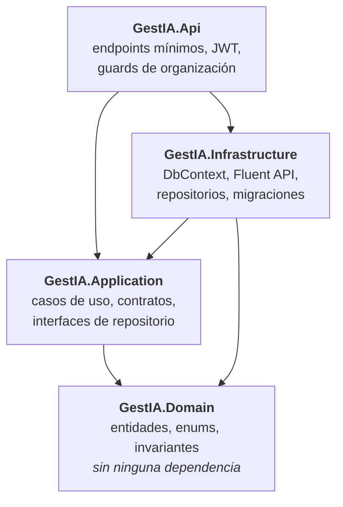
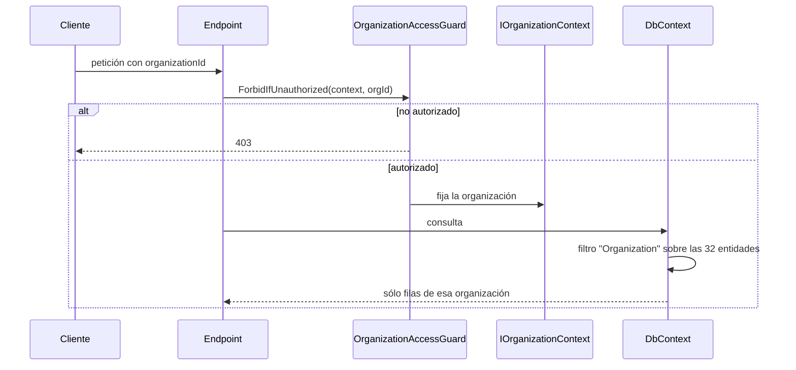
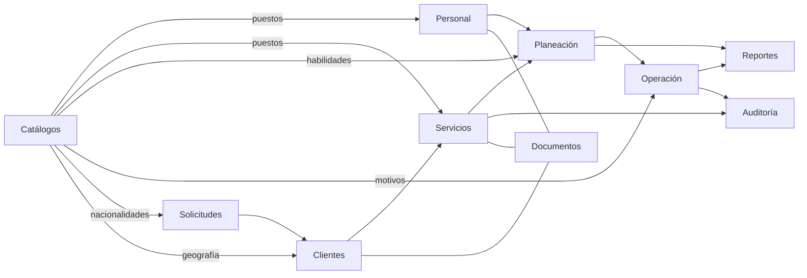
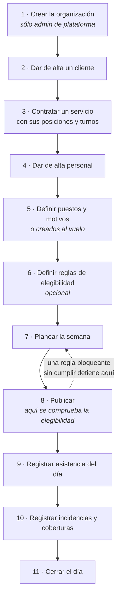

# GestIA — Arquitectura, módulos y roles

**Documento formal del sistema. Estado al 7 de septiembre de 2026, después de la tanda de
catálogos.**

Todo lo que sigue se leyó del código y de la base viva, no de la documentación anterior. Donde una
cifra del `CLAUDE.md` ya no coincide con el código, se dice en la sección 9 en lugar de repetirla.

| Referencia | Valor |
|---|---|
| Base viva | `db-gestia-dev`, **27 migraciones**, la última `20260907152722_RetireUnreadCatalogsAndGroupSynonyms` |
| Dominio público | `dev.gestia-demo.com` |
| Pruebas | **373** de backend, **626** de frontend |
| Compilación | `dotnet build` con 0 advertencias — en este repositorio una advertencia rompe el build |

---

## 1. Qué es GestIA

Una plataforma de operación para empresas de seguridad privada en México. Su unidad de trabajo no
es la persona: es la **posición operativa** —un puesto que hay que cubrir en un sitio, un día, un
turno—, que existe con independencia de quién la cubra.

De ahí sale casi todo lo demás. Una posición se planea antes de saber quién irá; se publica; se
cubre; y cuando quien iba no llega, alguien más la cubre y eso queda registrado como lo que es: una
sustitución con motivo, no un cambio silencioso en el plan.

---

## 2. Los ocho principios, y a qué obligan

No son lemas. Cada uno tiene una consecuencia técnica que el código impone.

| # | Principio | Lo que obliga en el código |
|---|---|---|
| 1 | La posición existe con independencia de la persona | La posición es una entidad propia, no un campo del empleado |
| 2 | Una captura operativa se reutiliza; no se recaptura | Tablero, incidencias y reportes leen el mismo registro |
| 3 | **Los registros operativos no se eliminan** | Borrado lógico vía `IActivatableEntity`; no hay `DELETE` en las rutas de negocio |
| 4 | Todo se conserva **por identificador**, no por nombre visible | Claves foráneas, no texto. Donde todavía se guarda texto, está señalado |
| 5 | El frontend no contiene reglas de negocio protegibles | Ocultar una opción del menú no es autorización; el servidor decide |
| 6 | Las dependencias apuntan hacia el dominio | Prueba de arquitectura que lee los `.csproj` |
| 7 | Los nombres no son definitivos hasta desplegarse en una migración revisada | Una migración desplegada no se reescribe |
| 8 | El paquete comercial de INSPINIA no entra completo a Git | Sólo piezas portadas, con su origen registrado |

### La consecuencia del principio 3 que más sorprende

**Una clave única sigue ocupada aunque el registro esté inactivo.** Desactivar un cliente no libera
su RFC; desactivar un valor de catálogo no libera su nombre. La comprobación de unicidad no
distingue activos de inactivos, y eso es correcto: si liberara la clave, un registro histórico
podría quedar apuntando a otra cosa.

En la práctica esto significa que **cualquier verificación que cree registros debe generar valores
nuevos en cada corrida**, y que su limpieza sólo puede desactivar, nunca borrar.

---

## 3. Arquitectura

### 3.1 Las cuatro capas

La forma no es una recomendación: `LayerDependencyTests` lee los `.csproj` y **falla si cambia**.
Si agregas una `ProjectReference` que rompa la dirección, la prueba te lo dice antes que el
revisor.

**Prohibiciones duras que también están probadas:**

- **Domain y Application no conocen EF Core.** Domain no tiene ninguna `PackageReference`;
  Application sólo tiene las abstracciones de inyección de dependencias.
- **La configuración física va con Fluent API en Infrastructure**, hoy en **36 clases**
  `IEntityTypeConfiguration<T>`. No hay atributos de mapeo en las entidades de Domain.
- **Los nombres de base de datos los valida el modelo al construirse.** Una configuración que no
  siga el estándar rompe la construcción del modelo, no pasa desapercibida.

### 3.2 El aislamiento entre organizaciones

Es la pieza de seguridad más importante del sistema, y **no es una condición que cada consulta
repita**. Es un filtro global con nombre:

Tres propiedades que hay que entender juntas:

1. **Falla cerrado.** Sin organización fijada, la consulta devuelve **cero filas**, no todas. Un
   endpoint al que se le olvide el guard no filtra datos: no devuelve nada. El error se nota.
2. **Apagarlo es explícito y está en una lista blanca.** `IgnoreQueryFilters(["Organization"])`
   sólo lo pueden usar los archivos que `OrganizationFilterBypassTests` autoriza por nombre.
3. **`IgnoreQueryFilters()` sin argumentos rompe el build.** Apagar todos los filtros a la vez no
   es una opción disponible.

El guard va acompañado siempre de `.RequirePermission(...)`: alcance y permiso son dos preguntas
distintas y se responden por separado.

### 3.3 La bitácora funcional

`SaveChanges` emite un `OperationalEvent` por cada cambio a **cinco entidades**, en la misma
transacción que el cambio:

| Entidad | Qué registra |
|---|---|
| `AttendanceRecord` | Asistencia |
| `ServiceConfiguration` | Configuración del servicio |
| `Incident` | Incidencias |
| `CoverageRecord` | Coberturas |
| `ServiceAssignment` | Asignaciones |

Dos reglas sobre las bitácoras:

- **Son de sólo agregar.** Modificar o borrar un `OperationalEvent` lanza excepción en
  `SaveChanges`.
- **Sus fotos no copian texto libre.** El snapshot guarda metadatos con lista blanca: de un campo
  de texto libre guarda **si estaba lleno o vacío**, nunca su contenido. Copiarlo lo sacaría del
  control de permisos del registro original.

Esto **no reemplaza** el historial funcional de valor anterior, valor nuevo, motivo, usuario y
fecha. Son dos cosas distintas: la bitácora es transversal, el historial es del negocio.

### 3.4 Nomenclatura de base de datos

`GestIaDatabaseStandards.ApplyGestIaDatabaseStandards()` valida el modelo al construirlo y asigna
nombres deterministas.

| Objeto | Regla | Ejemplo |
|---|---|---|
| Base | `db-{proyecto}-{ambiente}`, minúsculas | `db-gestia-dev` |
| Tabla | PascalCase plural | `Services`, `BusinessDocuments` |
| Columna | PascalCase singular | `StartDate` |
| Clave primaria | `Id{Entidad}` | `IdService` |
| Clave foránea | `Id{EntidadRelacionada}` | `IdOrganization` |
| Índice | `IX_{Tabla}_{Cols}`, único `UX_` | `UX_Users_Email` |

Semántica que conviene saber al leer cualquier tabla:

- **Booleanos** empiezan con `Is`, `Has` o `Can`. La única excepción es el campo transversal
  `Active`.
- **Instantes** terminan en `At` y **son UTC por contrato**. No se les agrega `Utc` al nombre.
- **Fechas de negocio** terminan en `Date` y son `date`, no `datetime2`.
- **Importes** son `decimal(19,4)`; **horas**, `decimal(9,4)`. `float` y `real` están prohibidos en
  importes.

### 3.5 Stack

| | |
|---|---|
| Backend | .NET 10 (`net10.0`), EF Core 10.0.10, SQL Server |
| Frontend | Angular 22 con señales, TypeScript 6, Tailwind 4 vía PostCSS, Vitest sobre jsdom |
| Infraestructura | Docker Compose, un solo stack; túnel Cloudflare con nombre como servicio de Windows |

`Directory.Build.props` aplica a todo el backend y no es negociable:
`TreatWarningsAsErrors`, `EnforceCodeStyleInBuild`, `Nullable=enable`,
`AnalysisLevel=latest-recommended`.

---

## 4. Seguridad: permisos y roles

### 4.1 Los 23 permisos

| Módulo | Lectura | Escritura |
|---|---|---|
| Plataforma | — | `PLATFORM.ADMIN` |
| Organizaciones | `ORGANIZATIONS.READ` | `ORGANIZATIONS.WRITE` |
| Usuarios | `USERS.READ` | `USERS.WRITE` |
| Clientes | `CLIENTS.READ` | `CLIENTS.WRITE` |
| Documentos | `DOCUMENTS.READ` | `DOCUMENTS.WRITE` |
| Documentos sensibles | `DOCUMENTS.SENSITIVE.READ` | `DOCUMENTS.SENSITIVE.WRITE` |
| Catálogos | `CATALOGS.READ` | `CATALOGS.WRITE` |
| Personal | `WORKFORCE.READ` | `WORKFORCE.WRITE` |
| Planeación | `PLANNING.READ` | `PLANNING.WRITE` |
| Operación | `OPERATIONS.READ` | `OPERATIONS.WRITE` |
| Solicitudes | `REQUESTS.READ` | `REQUESTS.WRITE` |
| Reportes | `REPORTS.READ` | — |
| Auditoría | `AUDIT.READ` | — |

Los documentos sensibles son un permiso **aparte** de los documentos normales: tener
`DOCUMENTS.READ` no da acceso a un documento marcado como sensible.

### 4.2 Los cinco roles

| Código | Nombre | Permisos |
|---|---|---|
| `ADMINISTRATOR` | Administrador | **Los 23** |
| `ORGANIZATION_ADMIN` | Admin de organización | **21** — todos salvo `PLATFORM.ADMIN` y `ORGANIZATIONS.WRITE` |
| `ORG_SUPERVISOR` | Supervisor operativo | **14** |
| `ORG_OPERATOR` | Operador | **10** |
| `ORG_VIEWER` | Consulta operativa | **8** |

Al detalle, para los tres roles operativos:

| Permiso | Supervisor | Operador | Consulta |
|---|:---:|:---:|:---:|
| `CLIENTS.READ` | ✅ | ✅ | ✅ |
| `DOCUMENTS.READ` | ✅ | ✅ | ✅ |
| `DOCUMENTS.WRITE` | ✅ | — | — |
| `CATALOGS.READ` | ✅ | ✅ | ✅ |
| `CATALOGS.WRITE` | — | — | — |
| `WORKFORCE.READ` | ✅ | ✅ | ✅ |
| `WORKFORCE.WRITE` | ✅ | — | — |
| `PLANNING.READ` | ✅ | ✅ | ✅ |
| `PLANNING.WRITE` | ✅ | — | — |
| `OPERATIONS.READ` | ✅ | ✅ | ✅ |
| `OPERATIONS.WRITE` | ✅ | ✅ | — |
| `REQUESTS.READ` | ✅ | ✅ | ✅ |
| `REQUESTS.WRITE` | ✅ | ✅ | — |
| `REPORTS.READ` | ✅ | ✅ | ✅ |
| `AUDIT.READ` | ✅ | — | — |

Cómo leerlo en una frase por rol:

- **Supervisor:** hace todo lo operativo y además contrata personal, planea y ve la auditoría. Lo
  único que no puede es tocar catálogos, usuarios ni organizaciones.
- **Operador:** captura el día —asistencia, incidencias, coberturas— y levanta solicitudes. No
  planea, no da de alta personal, no ve auditoría.
- **Consulta:** ve. No escribe nada, en ningún módulo.

### 4.3 Qué ve cada rol en el menú

El menú se filtra por tres cosas: el permiso, si hay organización activa, y si el usuario está
actuando como administrador de plataforma. Esa tercera hace que tres entradas sean **exclusivas**:
«Monitor global» y «Organizaciones» sólo aparecen en plataforma, y la entrada «Seguridad» tiene dos
caras que nunca se muestran juntas —`/seguridad` en plataforma, `/usuarios` dentro de una
organización—.

**Ocultar una opción no es autorización**: el servidor vuelve a comprobar cada petición.

| Grupo | Opción | Permiso | Admin plataforma | Admin org. | Supervisor | Operador | Consulta |
|---|---|---|:---:|:---:|:---:|:---:|:---:|
| Principal | Inicio | — | ✅ | ✅ | ✅ | ✅ | ✅ |
| Operación | Planeación | `PLANNING.READ` | ✅ | ✅ | ✅ | ✅ | ✅ |
| Operación | Asistencia | `OPERATIONS.READ` | ✅ | ✅ | ✅ | ✅ | ✅ |
| Operación | Incidencias | `OPERATIONS.READ` | ✅ | ✅ | ✅ | ✅ | ✅ |
| Operación | Cobertura | `OPERATIONS.READ` | ✅ | ✅ | ✅ | ✅ | ✅ |
| Operación | Solicitudes | `REQUESTS.READ` | ✅ | ✅ | ✅ | ✅ | ✅ |
| Reportes | Monitor global | `REPORTS.READ` | ✅ | — | — | — | — |
| Reportes | Reportes | `REPORTS.READ` | ✅ | ✅ | ✅ | ✅ | ✅ |
| Configuración | Organizaciones | `PLATFORM.ADMIN` | ✅ | — | — | — | — |
| Configuración | Clientes | `CLIENTS.READ` | ✅ | ✅ | ✅ | ✅ | ✅ |
| Configuración | Servicios | `CLIENTS.READ` | ✅ | ✅ | ✅ | ✅ | ✅ |
| Configuración | Personal | `WORKFORCE.READ` | ✅ | ✅ | ✅ | ✅ | ✅ |
| Configuración | Catálogos | `CATALOGS.READ` | ✅ | ✅ | ✅ | ✅ | ✅ |
| Configuración | Reglas documentales | `CATALOGS.READ` | ✅ | ✅ | ✅ | ✅ | ✅ |
| Configuración | Auditoría | `AUDIT.READ` | ✅ | ✅ | ✅ | — | — |
| Configuración | Seguridad *(plataforma)* | `PLATFORM.ADMIN` | ✅ | — | — | — | — |
| Configuración | Seguridad *(organización)* | `USERS.READ` | — | ✅ | — | — | — |

> **Diferencia con lo que puede hacer.** El menú es casi idéntico para los cinco roles porque casi
> todo se abre con permiso de lectura. Lo que cambia es **dentro** de cada pantalla: los botones de
> escritura no se dibujan sin el permiso correspondiente. Un operador entra a Catálogos y los ve,
> pero no puede crear ni editar nada.

---

## 5. Los módulos

Quince módulos en el frontend. Cada uno con `data-access/` y `pages/`.

### 5.1 Inicio *(overview)*

El tablero que abre la sesión del administrador de la organización. Franja de indicadores y lista
de asuntos que requieren atención.

Todo llega en **una sola petición** a `/api/v1/overview`. Antes eran ocho en paralelo, y la primera
impresión del producto no puede ser una espera.

El 6 de septiembre se retiró de aquí el «camino de configuración» de siete pasos: una pantalla que
cambiaba de propósito según cuántos datos hubiera son dos pantallas con un nombre. Si no hay
información, se ve sin información.

### 5.2 Clientes

Alta y expediente de clientes, con domicilios y sedes. El RFC es `varchar(13)` y se valida con el
formato oficial del SAT.

Un cliente desactivado **conserva ocupado su RFC y su código**.

### 5.3 Servicios

Los servicios contratados por cada cliente: vigencia, precio, posiciones que lo componen, patrones
de turno y sus segmentos. Es el módulo donde se define **qué hay que cubrir**.

### 5.4 Personal *(workforce)*

Expediente del empleado: datos, documentos, evaluaciones y puesto. El puesto se guarda **por
identificador** (`IdJobPositionCatalogItem`), no por texto.

Desde la tanda del 7 de septiembre, el puesto se puede **crear al vuelo** desde el propio
formulario del empleado, sin salir a Catálogos.

### 5.5 Planeación

Construye la semana: qué posición, qué día, qué turno, quién. Y la **publica**.

Publicar no es guardar. Al publicar, cada turno pasa por la comprobación de elegibilidad, y **una
regla bloqueante que no se cumple detiene la publicación entera** nombrando a la persona y el
motivo.

### 5.6 Operación

Tres pantallas y un cierre de día:

| Pantalla | Qué registra | Cómo guarda el motivo |
|---|---|---|
| **Asistencia** | Quién llegó, a qué hora, con qué excepción | — |
| **Incidencias** | Excepciones operativas clasificadas | **por nombre** (texto) |
| **Cobertura** | Sustituciones: quién iba, quién fue, por qué | **por identificador** |

Las tres emiten bitácora funcional. Las dos últimas usan el alta al vuelo del catálogo de motivos.

### 5.7 Solicitudes *(requests)*

Peticiones operativas con su ciclo: creación, cambio de estado, ejecución. Incluye el alta de
cliente, que es donde se usa el catálogo de nacionalidades.

### 5.8 Documentos

Expedientes documentales de clientes, servicios y personal, con revisión y vigencia. Los documentos
marcados como sensibles requieren su propio permiso.

### 5.9 Catálogos

Los valores que la organización define y las reglas de elegibilidad que se aplican con ellos.
Rehecha el 7 de septiembre; se detalla en la sección 6.

### 5.10 Reportes y Monitor

Reportes operativos y una vista de monitoreo transversal.

### 5.11 Auditoría

Trazabilidad de cambios. Lee las bitácoras y el historial funcional.

### 5.12 Seguridad y Usuarios

Usuarios, roles y accesos. La pantalla de plataforma y la de organización son distintas y se
separan por permiso.

### 5.13 Plataforma

Alta y administración de organizaciones. Sólo para `PLATFORM.ADMIN`.

### 5.14 Cómo dependen entre sí

La lectura corta: **Catálogos alimenta a casi todo el mundo**, la cadena
Clientes → Servicios → Planeación → Operación es la columna vertebral, y Reportes y Auditoría sólo
leen.

---

## 6. Los catálogos, después de la tanda del 7 de septiembre

### 6.1 Qué cambió

- **Desapareció el código.** `BusinessCatalogItem.Code` ya no existe. Un valor de catálogo se
  referencia por identificador, punto.
- **La unicidad la sostiene el nombre normalizado.** `NormalizedName` es una columna calculada
  persistida que SQL Server deriva del nombre: recorta, colapsa espacios, pasa a mayúsculas, y con
  intercalación `Latin1_General_CI_AI` los acentos no cuentan. El índice único es
  `(IdOrganization, Type, IdParentCatalogItem, NormalizedName)`, con la geografía fuera del filtro.
- **Se retiraron seis catálogos** que se podían llenar y que nadie leía: `Zone`,
  `CancellationReason`, `DocumentRequirement`, `EvaluationRequirement`, `ClientRestriction` y
  `ServiceRestriction`.
- **Se retiraron dos columnas sin lectores:** `CatalogGroup` y `Synonyms`.
- **`RequiredCode` se partió en tres.** Era un campo cuyo significado cambiaba con el tipo de
  regla; ahora cada tipo apunta a lo suyo y el servidor exige exactamente uno.
- **Alta al vuelo.** Un valor de catálogo se puede crear desde la pantalla donde hace falta.

### 6.2 Los catálogos que existen hoy, y quién los usa

| Catálogo | Quién lo lee | Cómo lo guarda | Filas en `db-gestia-dev` |
|---|---|---|---|
| **Puestos** | Personal, Servicios, Planeación | **identificador** | 14 |
| **Habilidades** | Reglas de elegibilidad | **identificador** | 11 |
| **Motivos de incidencia** | Operación | *nombre* | 25 |
| **Motivos de cobertura** | Operación, Planeación | **identificador** | 30 |
| **Nacionalidades** | Solicitudes | *nombre* | 5 |
| **Geografía** (país, estado, ciudad) | Clientes | *nombre* | 5 + 162 + 12 392 |

**La distinción entre identificador y nombre no es un detalle técnico**, y por eso la pantalla la
dice: por identificador, renombrar un valor lo renombra en todas partes; por nombre, los registros
anteriores conservan el texto viejo y nada avisa.

### 6.3 Las reglas de elegibilidad

| Tipo | Qué exige | Campo |
|---|---|---|
| `Skill` | Una habilidad del catálogo | `IdRequiredCatalogItem` |
| `Document` | Un tipo de documento del expediente | `RequiredDocumentType` |
| `Evaluation` | Un tipo de evaluación | `RequiredEvaluationType` |
| `Restriction` | Nada concreto: prohíbe | — |

Se aplican a toda la organización, a un cliente, a un servicio o a una posición. Una regla
**bloqueante** impide la asignación y la publicación; una informativa deja constancia.

**Sin reglas activas, validar a una persona no concluye que cumple: concluye que no se comprobó
nada.** El sistema no presenta la ausencia de reglas como cumplimiento.

### 6.4 La pantalla, rehecha

Dos zonas. Arriba, lo que la organización define, con cada catálogo diciendo quién lo usa y cómo;
la geografía plegada aparte. Abajo, plegadas, las listas fijas del sistema, que no se editan.

Se fueron el diálogo modal que recibía al usuario, las tres navegaciones que llevaban al mismo
sitio, las trece tarjetas de conteo y la columna «Usado en» que adivinaba comparando nombres.

---

## 7. El recorrido completo, de cero a un día operado

El paso 8 es el único que puede rechazar todo lo anterior, y lo hace nombrando a la persona y el
motivo.

---

## 8. Lo que el sistema no hace hoy

Dicho explícitamente, porque una ausencia no documentada se confunde con un defecto:

- **No otorga habilidades a las personas.** Ver la sección 9.1.
- **No tiene catálogo geográfico compartido.** Cada organización carga su propia copia de las
  mismas 12 559 filas de geografía.
- **No genera nómina ni factura.** No es su alcance.
- **No tiene aplicación móvil.** El portal es responsivo; no hay app nativa.
- **No cierra el mes.** El cierre es diario.

---

## 9. Lo que no cuadra

Esta sección existe porque un documento que sólo dice lo que funciona se lee como una promesa.

### 9.1 La trampa de las habilidades — prioridad alta

**Una regla de elegibilidad de tipo `Skill` se puede crear y no se puede cumplir.**

La regla se evalúa de verdad, y si es bloqueante detiene la publicación de la planeación. Pero
**ninguna pantalla permite otorgarle la habilidad a un empleado**: los endpoints existen, los
métodos del cliente Angular existen, y nadie los llama.

Quien cae en ella sólo puede salir desactivando la regla, que es lo contrario de lo que quería al
crearla. Y lo descubre al publicar la semana, que es cuando ya no hay tiempo.

Falta sólo la interfaz. Documento completo:
[`design/pendientes/TRAMPA-DE-HABILIDADES.md`](design/pendientes/TRAMPA-DE-HABILIDADES.md).

### 9.2 El alta al vuelo es invisible para quien más la necesitaba

`CATALOGS.WRITE` lo tienen **sólo los dos roles de administrador**. El supervisor, el operador y
consulta tienen `CATALOGS.READ` y nada más.

El alta al vuelo se construyó para que quien registra una incidencia no tenga que abandonarla a
medias e irse a Catálogos. Pero el operador —justo quien registra incidencias— **no ve el botón de
crear**, porque el componente no lo dibuja sin permiso de escritura, y hace bien: si lo dibujara,
el servidor devolvería 403.

No es un defecto del código; es una pregunta de diseño sin responder: **¿debe el operador poder
crear un motivo de incidencia?** Hoy la respuesta implícita es que no, y el resultado es que la
función existe para quien no la necesita.

### 9.3 Incidencia y cobertura guardan el motivo de forma distinta

`Incident.IncidentType` guarda **texto**. `CoverageRecord.IdCoverageReason` guarda **identificador**.

Las dos hacen lo mismo y no se parecen. La consecuencia práctica es que renombrar un motivo de
incidencia no cambia las incidencias ya registradas, sin que nada avise. Tiene tanda propia.

### 9.4 Tres pantallas existen y no están en el menú

`/documentos`, `/operacion` y `/plataforma/clientes-gestia` tienen ruta y componente, pero ninguna
entrada de navegación. Se llega a ellas sólo escribiendo la dirección.

`/documentos` es la que más llama la atención: es un módulo completo, con permiso propio, al que no
lleva ningún enlace.

### 9.5 El `CLAUDE.md` dice 29 entidades con alcance de organización; son 32

Contadas en el código: **32** implementan `IOrganizationScopedEntity`. La cifra de la documentación
se quedó atrás. No afecta al comportamiento —el filtro se aplica a todas las que declaran la
interfaz, no a una lista— pero conviene corregirla.

### 9.6 El patrón que se repite

Los hallazgos 9.1, 9.2 y 9.3 son la misma forma: **un dato o una regla que existe de un lado y no
viaja al otro, sin que nada falle.** No hay excepción, no hay error en el registro, no hay alerta.
Simplemente el otro lado no se enteró.

Vale la pena buscarlo a propósito cada vez que se cierra una tanda.

---

## 10. Reglas de operación que no se negocian

Para cualquiera que vaya a tocar este sistema:

1. **Una migración ya desplegada no se reescribe.** Se agrega una compensatoria. Editar el archivo
   de una migración aplicada deja el `__EFMigrationsHistory` de esa base inconsistente con el
   código.
2. **Antes de tocar una base que existe:** respaldo `COPY_ONLY` con `CHECKSUM`, verificado con
   `RESTORE VERIFYONLY WITH CHECKSUM`, y ensayo sobre una copia restaurada.
3. **Ninguna prueba automatizada apunta a `db-gestia-dev`.** Las de integración levantan un SQL
   Server efímero y lo desechan (`backend/pruebas-integracion.sh`).
4. **Si un trabajo no requiere cambio de esquema, se dice en voz alta** en lugar de crear una
   migración por costumbre.
5. **EF genera `defaultValue: ""` en columnas `NOT NULL` sobre datos existentes.** Ha salido mal
   tres veces en este proyecto. Revisar toda migración generada antes de aplicarla.
6. **Una excepción a los estándares requiere un ADR previo**, no desactivar la validación global.
