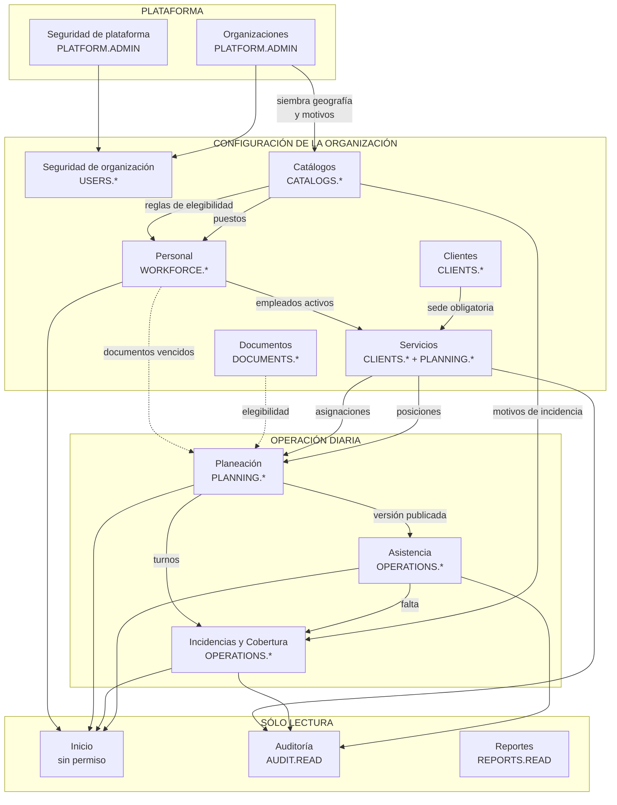
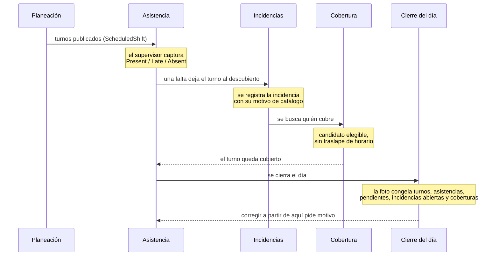
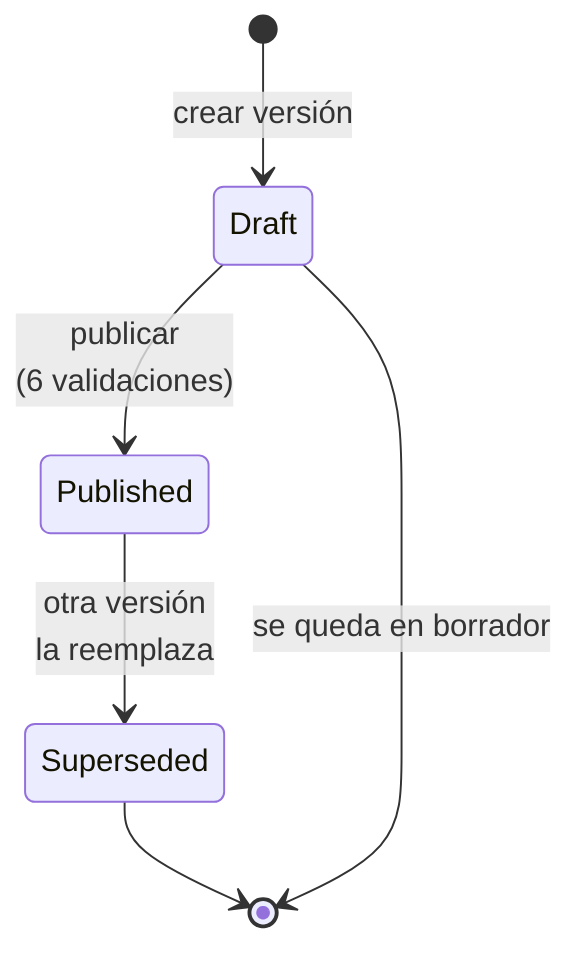
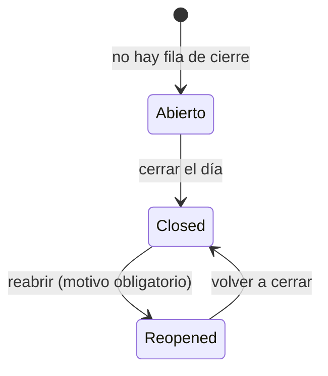
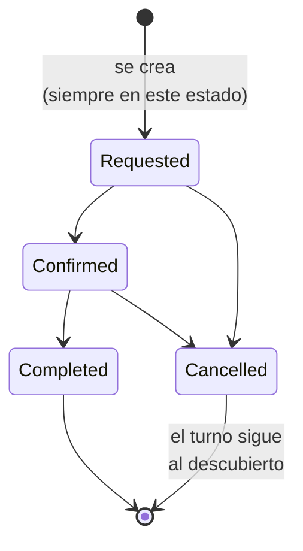
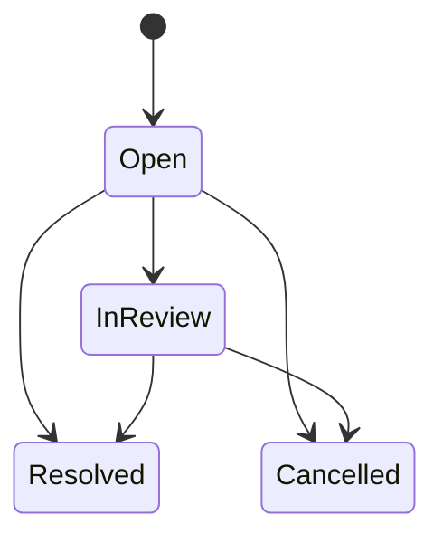
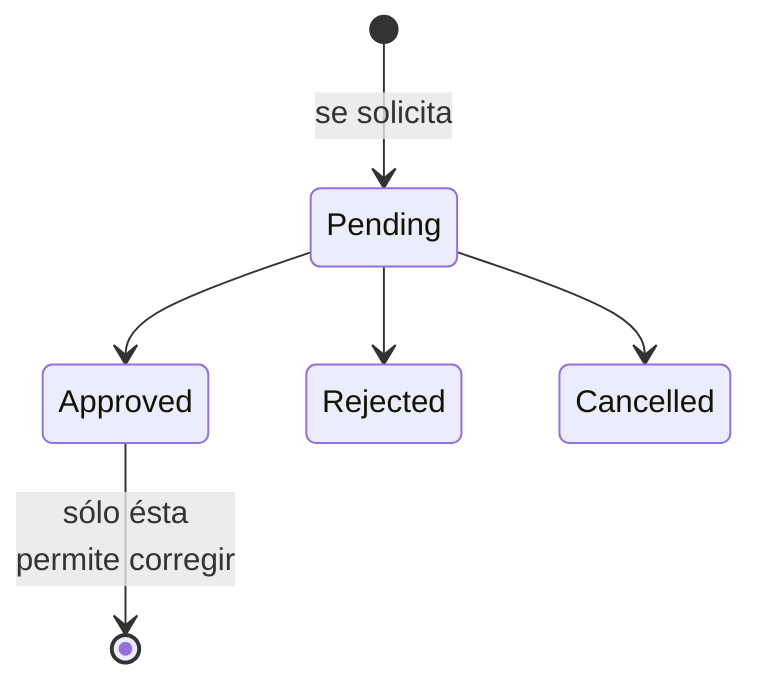
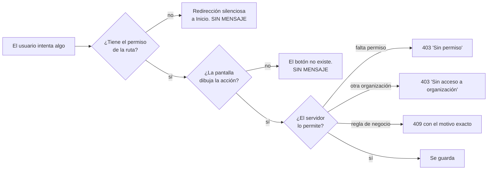

# Los módulos de GestIA y qué hace cada rol en ellos

**Levantado el 7 de septiembre de 2026** sobre el commit `a355011`. Como el
[mapa del sistema](MAPA-DEL-SISTEMA.md), esto describe **lo que el código hace**, no lo que la
documentación dice. Aquél recorre el flujo paso a paso; éste corta al revés: **módulo por módulo, y
dentro de cada uno, rol por rol**.

Los dos se complementan. Si buscas «¿por qué me salió este error?», ve al mapa. Si buscas «¿qué
puede hacer aquí un supervisor?», estás en el sitio correcto.

---

## Índice

1. [Cómo se relacionan los módulos](#1-cómo-se-relacionan-los-módulos)
2. [Ficha de cada módulo](#2-ficha-de-cada-módulo)
3. [La tabla cruzada: rol × módulo](#3-la-tabla-cruzada-rol--módulo)
4. [Los estados que recorre cada cosa](#4-los-estados-que-recorre-cada-cosa)
5. [Cómo se ve un «no puedes» en cada módulo](#5-cómo-se-ve-un-no-puedes-en-cada-módulo)
6. [Módulos que existen y no se ven](#6-módulos-que-existen-y-no-se-ven)

---

## 1. Cómo se relacionan los módulos

### 1.1 La forma general

Hay **tres anillos**. De fuera hacia dentro: la plataforma, la configuración de la organización, y
la operación diaria. Cada anillo sólo puede existir si el de fuera ya existe.



Y en texto, por si el diagrama no se dibuja donde lo leas:

```text
  PLATAFORMA
    Organizaciones ──┬──> Seguridad de organización
                     └──> Catálogos (siembra geografía + motivos al crear la organización)

  CONFIGURACIÓN
    Catálogos ───────┬──> Personal (puestos, reglas de elegibilidad)
                     └──> Incidencias (motivos de incidencia y de cobertura)
    Clientes ────────────> Servicios      (una sede es obligatoria)
    Personal ────────────> Servicios      (asignar exige empleados activos)
    Servicios ───────────> Planeación     (posiciones, patrones y asignaciones)

  OPERACIÓN
    Planeación ──────────> Asistencia     (sólo sobre versión PUBLICADA)
    Asistencia ──────────> Incidencias    (la falta abre la incidencia)
    Planeación ──────────> Cobertura      (se cubre un turno, no una persona)

  TRANSVERSAL
    Documentos y Personal ──> elegibilidad ──> bloquea Planeación y Cobertura
    Todo lo operativo ─────> Inicio (indicadores) y Auditoría (bitácora)
```

### 1.2 Las cuatro dependencias que de verdad bloquean

Las flechas del diagrama no pesan igual. **Cuatro son paredes de servidor** —si no se cumplen, sale
un 409— y el resto son comodidades.

| Dependencia | Qué pasa si falta | Mensaje |
|---|---|---|
| **Cliente → sede → Servicio** | no se puede crear el servicio | `La sede seleccionada no pertenece al cliente.` |
| **Servicio → posición → patrón con segmentos → Planeación** | no se puede proyectar | `No hay patrones de turno vigentes para generar la planeación.` |
| **Posiciones + Personal → asignaciones → Planeación** | se proyectan cero turnos, y publicar falla | `No se puede publicar la planeación porque hay posiciones sin cubrir.` |
| **Planeación publicada → Asistencia y Cobertura** | no se puede capturar nada | `Solo se puede operar asistencia/cobertura sobre planeaciones publicadas.` |

**La cuarta es la más importante de entender**: la operación diaria **no existe sin una versión
publicada**. No es que se vea vacía: el servidor rechaza cualquier escritura.

### 1.3 El camino del dato en un día normal



**Ojo con la última flecha.** El cierre cambia las reglas de todo lo anterior: a partir de ahí,
corregir una asistencia, una incidencia o una cobertura de ese día **exige un motivo de 10
caracteres mínimo**. Reabrir el día quita esa exigencia, porque reabrirlo ya fue una decisión
justificada por sí misma.

### 1.4 Quién escribe en cada tabla

Un módulo «posee» sus entidades, pero varias se escriben desde más de un sitio. Esto es lo que
confunde cuando alguien busca dónde se creó una fila.

```text
  Organizations, Users, OrganizationMemberships, UserRoles
      <- Organizaciones (alta con admin, en una sola transacción)
      <- Seguridad de plataforma
      <- Seguridad de organización (sólo Users y membresías de SU organización)

  BusinessCatalogItems
      <- Catálogos (alta manual)
      <- Organizaciones (siembra automática al crear la organización)

  Clients, ClientSites, ClientContacts, Services, ServiceConfigurations
      <- Clientes y Servicios
      <- Solicitudes (al EJECUTAR una solicitud aprobada; hoy fuera del menú)

  ServiceAssignments
      <- Servicios, pestaña Asignaciones
      <- Solicitudes (tipo StaffChange)

  CoverageRecords
      <- Incidencias y Cobertura
      <- Solicitudes (tipo CoverageSupport)

  OperationalEvents (bitácora funcional)
      <- NADIE directamente. Los emite SaveChanges por cada cambio a las cinco
         entidades con historial, en la misma transacción que el cambio.
```

**Solicitudes es una segunda puerta a las mismas entidades.** Está fuera del menú de fase 1, pero el
módulo funciona: ejecutar una solicitud aprobada **crea clientes, sedes, servicios, asignaciones y
coberturas reales**. Si un día se reactiva, hay dos caminos para crear lo mismo.

---

## 2. Ficha de cada módulo

Cada ficha dice: qué hace, con qué permisos, qué escribe, de qué depende, qué habilita, y **qué ve
cada uno de los cinco roles**.

Convención de la última columna:

- **Completo** — ve el módulo y puede escribir en él.
- **Sólo lectura** — ve el módulo, no puede guardar.
- **No lo ve** — la entrada no aparece en el menú y la ruta redirige a Inicio en silencio.

---

### 2.1 Inicio

| | |
|---|---|
| **Ruta** | `/` |
| **Permiso** | **ninguno**. Es la única entrada del menú sin permiso |
| **Endpoint** | `GET /api/v1/overview` |
| **Escribe** | nada |
| **Depende de** | todo lo demás, para tener algo que decir |

Es el tablero del administrador de la organización, y **sólo eso**. Cuatro indicadores y una lista
de lo que necesita atención. Desde el 6 de septiembre de 2026 no lleva camino de configuración: si
no hay información, se ve sin información.

**Los indicadores se filtran por permiso en el servidor**, así que no todos ven los cuatro:

| Indicador | Aparece si el rol tiene |
|---|---|
| Turnos planeados · semana | `PLANNING.READ` |
| Posiciones sin titular | `PLANNING.READ` |
| Turnos sin cubrir · ayer | `OPERATIONS.READ` |
| Empleados con documentos vencidos | `WORKFORCE.READ` |

| Rol | Qué ve |
|---|---|
| Super admin | **Fuera de organización**: no hay tablero, sino «Elige una organización para ver su inicio». **Dentro**: los cuatro indicadores |
| Admin de organización | Los cuatro |
| Supervisor | Los cuatro |
| Operador | Los cuatro |
| Consultor | Los cuatro |

Los cinco roles operativos tienen los tres permisos de lectura, así que **en Inicio se ve lo mismo
para todos**. Lo que cambia es a dónde llevan los botones, y ahí sí topan con lo que no pueden.

---

### 2.2 Organizaciones

| | |
|---|---|
| **Ruta** | `/plataforma/organizaciones` |
| **Permiso** | `PLATFORM.ADMIN` para la entrada del menú; `ORGANIZATIONS.READ` / `ORGANIZATIONS.WRITE` en los endpoints |
| **Escribe** | `Organizations` y, en el alta con admin, `Users` + `OrganizationMemberships` + `UserRoles` + los catálogos por omisión |
| **Depende de** | nada |
| **Habilita** | todo |

El alta con admin es **una sola transacción**: organización, usuario, membresía, rol
`ORGANIZATION_ADMIN` y siembra de catálogos. La contraseña temporal **la teclea el super admin**
(mínimo 12 caracteres), llega al admin por fuera del sistema y **no se le obliga a cambiarla**.

Lo que siembra: país `MX`, nacionalidad, **todos los estados y municipios de México**, 5 motivos de
incidencia y 6 de cobertura. **No siembra puestos, habilidades ni zonas.**

| Rol | Qué ve |
|---|---|
| Super admin | **Completo.** Además, gobernanza (`/organizations/governance`, sólo `PLATFORM.ADMIN`) |
| Admin de organización | **No lo ve.** Tiene `ORGANIZATIONS.READ` pero la entrada exige `PLATFORM.ADMIN`. Por API vería sólo **su propia organización**: `FilterOrganizationsForUser` recorta la lista a sus membresías |
| Supervisor / Operador / Consultor | **No lo ven.** Ni siquiera tienen `ORGANIZATIONS.READ` |

---

### 2.3 Seguridad

**Son dos pantallas distintas bajo el mismo nombre**, y la que ves depende de si eres super admin.

| | Plataforma | Organización |
|---|---|---|
| **Ruta** | `/seguridad` | `/usuarios` |
| **Permiso** | `PLATFORM.ADMIN` | `USERS.READ` / `USERS.WRITE` |
| **Endpoints** | `/api/v1/security/*` | `/api/v1/organization-security/*` |
| **Alcance** | usuarios, **roles** y permisos de toda la plataforma | usuarios de **una** organización |
| **Roles asignables** | **todos**, incluido `ORGANIZATION_ADMIN` | **todos menos** `ADMINISTRATOR`, `ORGANIZATION_ADMIN` y cualquiera con `PLATFORM.ADMIN` |

**La consecuencia práctica de esa última fila:** un admin de organización **no puede crear otro admin
de organización**. Sólo puede crear supervisores, operadores y consultores.

Y no hay ninguna protección contra quitarse el acceso a uno mismo: un admin con `USERS.WRITE` puede
desactivarse o retirarse su propia membresía, y entonces **sólo el super admin puede devolvérselo**.

| Rol | Qué ve |
|---|---|
| Super admin | **Completo**, la de plataforma. Crea y edita roles, que no puede nadie más |
| Admin de organización | **Completo**, la de organización, con la limitación de roles de arriba |
| Supervisor / Operador / Consultor | **No lo ven.** Ninguno tiene `USERS.READ` |

---

### 2.4 Catálogos

| | |
|---|---|
| **Ruta** | `/catalogos` |
| **Permiso** | `CATALOGS.READ` para ver, `CATALOGS.WRITE` para escribir |
| **Escribe** | `BusinessCatalogItems`, `EligibilityRequirements` |
| **Depende de** | nada (la geografía ya viene sembrada) |
| **Habilita** | **puestos** para Personal, **motivos** para Incidencias y Cobertura, **reglas de elegibilidad** para Planeación y Cobertura |

Catorce tipos de catálogo: `Skill`, `JobPosition`, `DocumentRequirement`, `EvaluationRequirement`,
`ClientRestriction`, `ServiceRestriction`, `Zone`, `IncidentReason`, `CoverageReason`,
`CancellationReason`, `Country`, `State`, `City`, `Nationality`.

Lo único que **de verdad hay que configurar aquí** en una organización nueva son los **puestos**.

**Aquí vive el arma más peligrosa del sistema**: las reglas de elegibilidad. Una regla bloqueante de
tipo `Skill` o `Evaluation` **no se puede satisfacer desde la interfaz** —no hay pantalla para dar de
alta una habilidad ni una evaluación—, así que deja al empleado bloqueado para publicar y para
cubrir, y la única salida es volver aquí y desactivar la regla. Está en el hallazgo 8.4 del mapa.

| Rol | Qué ve |
|---|---|
| Super admin | **Completo** |
| Admin de organización | **Completo** |
| Supervisor | **Sólo lectura.** Tiene `CATALOGS.READ` sin `WRITE`: ve el módulo y **no puede crear el puesto que Personal necesita** |
| Operador | **Sólo lectura** |
| Consultor | **Sólo lectura** |

---

### 2.5 Clientes

| | |
|---|---|
| **Ruta** | `/clientes` |
| **Permiso** | `CLIENTS.READ` / `CLIENTS.WRITE` |
| **Escribe** | `Clients`, `ClientSites`, `ClientContacts` |
| **Depende de** | nada |
| **Habilita** | **Servicios: sin sede no hay servicio** |

Pantalla **rehecha**, con componentes hijos y sin selectores nativos.

Código y RFC son únicos, **y siguen ocupados aunque el cliente esté inactivo**: el borrado es lógico
y los índices únicos no filtran por `Active`.

| Rol | Qué ve |
|---|---|
| Super admin | **Completo** |
| Admin de organización | **Completo** |
| Supervisor | **Sólo lectura.** Tiene `CLIENTS.READ` sin `WRITE`; la pantalla **no dibuja** el botón de alta |
| Operador | **Sólo lectura** |
| Consultor | **Sólo lectura** |

---

### 2.6 Servicios

| | |
|---|---|
| **Ruta** | `/servicios` |
| **Permiso** | **dos, mezclados**: `CLIENTS.*` para los datos y la configuración; `PLANNING.*` para posiciones y asignaciones |
| **Escribe** | `Services`, `ServiceConfigurations`, `ServiceContracts`, `Positions`, `ShiftPatterns`, `ShiftSegments`, `ServiceAssignments` |
| **Depende de** | un cliente **con sede**; para asignar, empleados activos |
| **Habilita** | Planeación |

**Es el módulo más cargado del sistema**: 1803 líneas en una sola página con cuatro pestañas —Datos,
Configuración, Posiciones, Asignaciones— y ahí ocurren **tres de los once pasos** del recorrido
(el 5, el 6 y el 8). Conserva cuerpo viejo: 6 selectores nativos y 29 colores escritos a mano.

**El reparto de permisos por pestaña es lo que más sorprende:**

| Pestaña | Permiso de escritura |
|---|---|
| Datos del servicio, contrato | `CLIENTS.WRITE` |
| Configuración (precio, horas, elementos) | `CLIENTS.WRITE` |
| **Posiciones, patrones y segmentos** | **`PLANNING.WRITE`** |
| **Asignaciones de personal** | **`PLANNING.WRITE`** |

| Rol | Qué ve |
|---|---|
| Super admin | **Completo** |
| Admin de organización | **Completo** |
| Supervisor | **Mitad y mitad.** `PLANNING.WRITE` sí, `CLIENTS.WRITE` no: **puede definir posiciones y asignar personal, y no puede crear ni editar el servicio** |
| Operador | **Sólo lectura** |
| Consultor | **Sólo lectura** |

La fila del supervisor es la más útil de esta ficha: es un rol que **puede montar la operación de un
servicio que otro creó**, pero no puede crear el servicio.

---

### 2.7 Personal

| | |
|---|---|
| **Ruta** | `/personal` |
| **Permiso** | `WORKFORCE.READ` / `WORKFORCE.WRITE` |
| **Escribe** | `Employees`, `EmployeeDocuments`, `EmployeeEvaluations` |
| **Depende de** | nada obligatorio: **el puesto de catálogo es opcional** |
| **Habilita** | asignaciones, y por tanto la planeación |

Pantalla **rehecha**, con nueve componentes hijos.

El expediente muestra los requisitos de elegibilidad del empleado y el estado de sus documentos,
calculado contra el día operativo: vencido, por vencer en 30 días, o vigente.

**El código de empleado lo genera el navegador**, no el servidor, con la marca de tiempo en base 36.
Es deuda anotada.

| Rol | Qué ve |
|---|---|
| Super admin | **Completo** |
| Admin de organización | **Completo** |
| Supervisor | **Completo.** Tiene `WORKFORCE.WRITE` |
| Operador | **Sólo lectura** |
| Consultor | **Sólo lectura** |

---

### 2.8 Documentos

| | |
|---|---|
| **Ruta** | `/documentos` — **sin entrada de menú** |
| **Permiso** | `DOCUMENTS.READ` / `DOCUMENTS.WRITE`, más `DOCUMENTS.SENSITIVE.READ` / `.WRITE` para los marcados sensibles |
| **Escribe** | `BusinessDocuments`, `BusinessDocumentEvents` |
| **Depende de** | tener a qué colgar el documento: cliente, servicio, empleado o evaluación |
| **Habilita** | la elegibilidad documental |

**Sólo se alcanza escribiendo la URL.** No hay ninguna entrada de menú que apunte ahí. Es el
hallazgo 8.3 del mapa.

Los documentos sensibles llevan su propio par de permisos, y son los dos únicos sitios del sistema
que devuelven un 403 con mensaje propio: `No tienes permiso para acceder a documentos sensibles.` y
`No tienes permiso para modificar documentos sensibles.`

| Rol | Qué ve |
|---|---|
| Super admin | **Completo**, sensibles incluidos |
| Admin de organización | **Completo**, sensibles incluidos |
| Supervisor | **Escribe los normales, no ve los sensibles.** Tiene `DOCUMENTS.WRITE` pero no los dos `SENSITIVE` |
| Operador | **Sólo lectura**, sin sensibles |
| Consultor | **Sólo lectura**, sin sensibles |

---

### 2.9 Planeación

| | |
|---|---|
| **Ruta** | `/planeacion` |
| **Permiso** | `PLANNING.READ` / `PLANNING.WRITE` |
| **Escribe** | `ScheduleVersions`, `ScheduledShifts`, y los segmentos del patrón desde la rejilla |
| **Depende de** | patrones con segmentos **y** asignaciones vigentes |
| **Habilita** | **toda la operación diaria** |

Pantalla **rehecha**. La rejilla enseña los siete días siempre, y distingue cuatro estados de celda:
cubierto, corto, **sin turno** (declarado) y **sin declarar** (nadie decidió). Esa distinción es a
nivel de posición, no de día: ver la sección 7 del mapa.

«Preparar la semana» es un solo botón: crea la versión si no existe y proyecta los turnos desde los
patrones, sin pisar lo asignado a mano.

**Aviso al recorrer:** la pantalla dice que los huecos de cobertura **no impiden publicar** y deja el
botón habilitado; el servidor los rechaza con un 409. Es el hallazgo 8.1 del mapa, y es una decisión
de negocio pendiente, no un arreglo obvio.

| Rol | Qué ve |
|---|---|
| Super admin | **Completo** |
| Admin de organización | **Completo** |
| Supervisor | **Completo.** Tiene `PLANNING.WRITE` |
| Operador | **Sólo lectura.** Ve la semana publicada, no puede publicar ni tocar patrones |
| Consultor | **Sólo lectura** |

---

### 2.10 Asistencia

| | |
|---|---|
| **Ruta** | `/operacion/asistencia` |
| **Permiso** | `OPERATIONS.READ` / `OPERATIONS.WRITE` |
| **Escribe** | `AttendanceRecords`, `OperationDayClosures`, `ApprovalRequests` |
| **Depende de** | **una versión publicada que cubra el día** |
| **Habilita** | incidencias, cobertura y el cierre |

Pantalla **rehecha**. Se construye sobre los **turnos publicados**, no sobre lo capturado: por eso
puede decir qué falta por capturar.

Separa dos listas que se confunden: **excepciones** (asistencias `Absent` o `Late`) y **pendientes
de capturar** (turnos sin fila). No capturar no es una excepción, es trabajo pendiente.

**Las dos exigencias de la corrección son independientes y no hay que confundirlas:**

| | Cuándo se exige | Qué es |
|---|---|---|
| **Autorización previa** | al corregir **y sólo si cambió un dato** | un permiso aprobado de antemano, que apunta a **ese** registro |
| **Motivo de la corrección** | cuando **el día está cerrado** | qué se hizo y por qué; va a la bitácora |

Puedes necesitar una, la otra, las dos o ninguna.

| Rol | Qué ve |
|---|---|
| Super admin | **Completo** |
| Admin de organización | **Completo** |
| Supervisor | **Completo** |
| Operador | **Completo.** Tiene `OPERATIONS.WRITE`: **es su módulo** |
| Consultor | **Sólo lectura** |

---

### 2.11 Incidencias y Cobertura

| | |
|---|---|
| **Rutas** | `/operacion/incidencias` y `/operacion/cobertura` — **la misma pantalla** |
| **Permiso** | `OPERATIONS.READ` / `OPERATIONS.WRITE` |
| **Escribe** | `Incidents`, `CoverageRecords` |
| **Depende de** | versión publicada; para cubrir, un turno con falta; motivos de catálogo activos |

Son una pantalla a propósito: una falta abre una incidencia, y la incidencia se cierra cubriendo el
turno o dejándolo declarado sin cubrir.

**Tres reglas que conviene tener claras antes de recorrerla:**

1. **Registrar una incidencia sobre un día cerrado está permitido**, no se bloquea, y no pide motivo.
   La falta ocurrió; si el sistema no la deja registrar, se registra fuera del sistema. La pantalla
   la marca **«Posterior al cierre»**. Corregirla sí pide motivo.
2. **En el selector de candidatos nadie queda fuera.** Quien ya tiene turno ese día aparece con la
   consecuencia escrita: «P-04 queda con un elemento menos ese día: el hueco se mueve, no
   desaparece». Pero si el traslape es **de horario real**, el servidor lo rechaza igual.
3. **«Declarar sin cubrir» no es un botón ni un estado.** El turno queda al descubierto porque hubo
   falta y ninguna cobertura la resolvió, y eso se lee de los registros. Una cobertura **cancelada
   no cuenta**: cancelarla es justamente dejar el turno sin cubrir.

| Rol | Qué ve |
|---|---|
| Super admin | **Completo** |
| Admin de organización | **Completo** |
| Supervisor | **Completo** |
| Operador | **Completo.** También es su módulo |
| Consultor | **Sólo lectura** |

---

### 2.12 Auditoría

| | |
|---|---|
| **Ruta** | `/auditoria` |
| **Permiso** | `AUDIT.READ` |
| **Escribe** | nada. Es de sólo lectura por diseño |
| **Lee** | `OperationalEvents` |

La bitácora funcional es **de sólo agregar**: el `DbContext` rechaza modificar o borrar un evento.
`SaveChanges` emite uno por cada cambio a **cinco entidades y sólo cinco**:

`AttendanceRecord` · `ServiceConfiguration` · `Incident` · `CoverageRecord` · `ServiceAssignment`

**Las fotos no copian el texto libre**, sólo si estaba lleno o vacío: copiarlo lo sacaría del control
de permisos del registro original.

Pantalla con cuerpo viejo: 4 selectores nativos, 61 colores a mano.

| Rol | Qué ve |
|---|---|
| Super admin | **Completo** |
| Admin de organización | **Completo** |
| Supervisor | **Completo.** Tiene `AUDIT.READ` |
| Operador | **No lo ve** |
| Consultor | **No lo ve** |

---

### 2.13 Reportes y Monitor global

| | |
|---|---|
| **Rutas** | `/reportes`, `/monitor` |
| **Permiso** | `REPORTS.READ` (la ruta de Monitor exige `PLATFORM.ADMIN`) |
| **Estado** | **fuera del menú**, marcados `phase: 2` |

Las pantallas existen y funcionan; sólo están ocultas. Exportan a CSV, XLSX y PDF.

Los cinco roles tienen `REPORTS.READ`, así que el día que se quite la marca de fase 2 **los cinco
verán Reportes**. Monitor global no: exige `PLATFORM.ADMIN` en la ruta, aunque la entrada del menú
pide `REPORTS.READ` — dos fuentes de verdad que no coinciden (hallazgo 8.7 del mapa).

---

### 2.14 Solicitudes

| | |
|---|---|
| **Ruta** | `/solicitudes` |
| **Permiso** | `REQUESTS.READ` / `REQUESTS.WRITE` |
| **Escribe** | `OperationalRequests` y, **al ejecutar**, clientes, sedes, servicios, asignaciones y coberturas reales |
| **Estado** | **fuera del menú**, `phase: 2` |

Es **una segunda puerta a entidades que otros módulos también crean**. Seis tipos: `NewClient`,
`NewService`, `ServiceChange`, `CoverageSupport`, `StaffChange`, `Other`. Tiene vista previa de
impacto antes de ejecutar («Creará un nuevo cliente real», «Creará una sede para el cliente»).

Sólo se ejecutan las **aprobadas**: `Sólo se pueden ejecutar solicitudes aprobadas.`

Supervisor y operador tienen `REQUESTS.WRITE`, así que el día que se reactive **podrían crear
clientes y servicios por esta vía aunque no tengan `CLIENTS.WRITE`**. Vale la pena tenerlo presente
antes de quitarle la marca de fase 2.

---

## 3. La tabla cruzada: rol × módulo

**C** = completo · **L** = sólo lectura · **—** = no lo ve · **½** = parcial, ver nota

| Módulo | Permiso | Super admin | Admin org. | Supervisor | Operador | Consultor |
|---|---|:-:|:-:|:-:|:-:|:-:|
| **Inicio** | ninguno | C | C | C | C | C |
| **Organizaciones** | `PLATFORM.ADMIN` | C | — | — | — | — |
| **Seguridad de plataforma** | `PLATFORM.ADMIN` | C | — | — | — | — |
| **Seguridad de organización** | `USERS.*` | C | C¹ | — | — | — |
| **Catálogos** | `CATALOGS.*` | C | C | **L** | L | L |
| **Clientes** | `CLIENTS.*` | C | C | **L** | L | L |
| **Servicios · datos y configuración** | `CLIENTS.*` | C | C | **L** | L | L |
| **Servicios · posiciones y asignaciones** | `PLANNING.*` | C | C | **C** | L | L |
| **Personal** | `WORKFORCE.*` | C | C | **C** | L | L |
| **Documentos** | `DOCUMENTS.*` | C | C | **½**² | L | L |
| **Planeación** | `PLANNING.*` | C | C | **C** | L | L |
| **Asistencia** | `OPERATIONS.*` | C | C | C | **C** | **L** |
| **Incidencias y Cobertura** | `OPERATIONS.*` | C | C | C | **C** | **L** |
| **Auditoría** | `AUDIT.READ` | C | C | C | **—** | **—** |
| Reportes *(oculto)* | `REPORTS.READ` | C | C | C | C | C |
| Solicitudes *(oculto)* | `REQUESTS.*` | C | C | C | C | L |
| **Entradas de menú visibles** | | **12**³ | **11** | **10** | **9** | **9** |

¹ No puede asignar el rol `ORGANIZATION_ADMIN`: sólo supervisor, operador y consultor.
² Escribe documentos normales; **no ve los sensibles**.
³ Dentro de una organización. Fuera de ella ve 3: Inicio, Organizaciones y Seguridad.

### La lectura corta de esa tabla

- **El admin de organización lo hace todo dentro de su organización.** No necesita al super admin
  para nada del recorrido.
- **El supervisor es el rol operativo completo**: monta posiciones, asigna gente, publica la semana,
  captura y cubre. Lo único que no puede es **crear clientes, servicios ni catálogos**.
- **El operador vive en los dos últimos pasos**: asistencia y cobertura. Todo lo demás lo mira.
- **El consultor no escribe nada, en ningún módulo.**
- **Auditoría es la única línea donde operador y consultor difieren del supervisor** en visibilidad
  de módulo. En todo lo demás ven las mismas nueve entradas y se distinguen por dentro.

---

## 4. Los estados que recorre cada cosa

Los estados guardados, con sus transiciones reales. Sirven para saber si algo «está atorado» o
simplemente está donde debe.

### 4.1 La versión de planeación



**Sólo `Published` habilita la operación.** Una versión sólo se puede reemplazar si la nueva cubre
todo su periodo y la anterior **no tiene actividad operativa registrada**: si ya hay asistencia o
cobertura contra ella, no hay salida por interfaz.

### 4.2 El día operativo



**«Abierto» no es un valor guardado: es la ausencia de fila** en `OperationDayClosures`.

Y el estado cambia las reglas de lo demás:

| Estado del día | Corregir asistencia/incidencia/cobertura | Registrar incidencia nueva |
|---|---|---|
| **Abierto** | sin motivo | sin marca |
| **Closed** | **motivo obligatorio**, 10 caracteres mínimo | permitido, marcado **«Posterior al cierre»** |
| **Reopened** | sin motivo | permitido, **sin marca** |

### 4.3 La cobertura



**Sólo `Confirmed` y `Completed` cubren el turno.** Una cancelada no cuenta, y la lista lo dice sin
rodeos: «El turno sigue al descubierto».

### 4.4 La incidencia



**`Open` e `InReview` cuentan como abiertas**, y una incidencia abierta **impide cerrar el día**:
`No se puede cerrar el día: N turno(s) sin asistencia y M incidencia(s) abierta(s).`

### 4.5 La autorización para corregir



Debe coincidir en **cuatro cosas** con el registro que se corrige: servicio, tipo de autorización,
tipo de entidad e identificador. Si falla una: `La autorización seleccionada no corresponde al
registro que se intenta corregir.`

### 4.6 Los demás estados, en corto

| Cosa | Estados |
|---|---|
| **Asistencia** | `Expected` · `Present` · `Late` · `Absent` · `Excused` |
| **Empleado** | `Candidate` · `Active` · `OnLeave` · `Inactive` · `Terminated` — **sólo `Active` se puede asignar, programar o usar como sustituto** |
| **Documento de empleado** | `Pending` · `Received` · `Validated` · `Rejected` · `Expired` · `NotApplicable` — la elegibilidad **sólo acepta `Received` y `Validated`** |
| **Contrato de servicio** | `Draft` · `UnderReview` · `Executed` · `Effective` · `Expired` · `Terminated` |
| **Tipo de asignación** | `Primary` · `Support` · `Relief` · `TemporaryReplacement` — el generador prefiere `Primary` |
| **Solicitud operativa** | `Draft` · `Submitted` · `InReview` · `Approved` · `Rejected` · `Cancelled` · `Completed` |

---

## 5. Cómo se ve un «no puedes» en cada módulo

Hay **cuatro formas distintas** de que el sistema te diga que no, y se ven muy diferente. Saber
cuál es cuál evita confundir una decisión con un defecto.



| Forma | Cómo se ve | Dónde pasa |
|---|---|---|
| **1. Redirección silenciosa** | apareces en Inicio sin explicación | escribir a mano una ruta cuyo permiso no tienes |
| **2. La acción no se dibuja** | no hay botón, no hay error | las pantallas rehechas usan `canWrite()` y **ocultan** en vez de deshabilitar |
| **3. 403 con mensaje** | aviso rojo con el texto del servidor | llamada por API, o pantalla vieja que dejó el control puesto |
| **4. 409 con el motivo** | aviso rojo con la regla exacta que se aplicó | reglas de negocio: traslapes, elegibilidad, cierres, unicidad |

**La forma 2 es la que más despista al recorrer.** Si entras como supervisor a Catálogos y no ves el
botón de crear, no está roto: no tienes `CATALOGS.WRITE`. Si entras a Clientes y no ves «Nuevo
cliente», lo mismo.

**Y una irregularidad conocida:** las pantallas viejas no aplican todas el mismo patrón.
`catalogs-page`, `documents-page` y `services-page` sí comprueban la escritura; **`security-page` no
comprueba ninguna**, así que un rol con `USERS.READ` sin `USERS.WRITE` vería los controles y
recibiría un 403 al guardar. Hoy no muerde porque ningún rol sembrado tiene esa combinación.

---

## 6. Módulos que existen y no se ven

Para cerrar el mapa: cuatro cosas que están en el código y no aparecen en el menú, con el motivo de
cada una.

| Qué | Dónde vive | Por qué no se ve |
|---|---|---|
| **Reportes** | `/reportes`, pantalla de 645 líneas | Fuera de fase 1, marcado `phase: 2`. **Oculto, no borrado** |
| **Monitor global** | `/monitor` | Ídem, y además la ruta y el menú piden permisos distintos |
| **Solicitudes** | `/solicitudes`, 1563 líneas, con seis tipos y ejecución real | Ídem. Es una **segunda puerta** a clientes, servicios, asignaciones y coberturas |
| **Reglas documentales** | `/configuracion/documentos` | Ídem. Es una vista de Catálogos con la pestaña de elegibilidad abierta |
| **Documentos** | `/documentos`, 1216 líneas | **No está marcada como fase 2 ni tiene entrada de menú.** Es el hallazgo 8.3: o falta la entrada, o falta la marca |
| **`SupportSessions`** | tabla en la base, con su configuración y su `DbSet` | **Resto del modo soporte retirado.** No hay servicio, ni endpoint, ni pantalla, ni nadie que la lea. Es una tabla muerta |

Esa última fila conviene tenerla presente si alguien va a buscar cómo entraba antes el super admin a
una organización: **la tabla existe y está vacía**, y hoy el acceso es una selección de la interfaz
que no deja ningún rastro.
