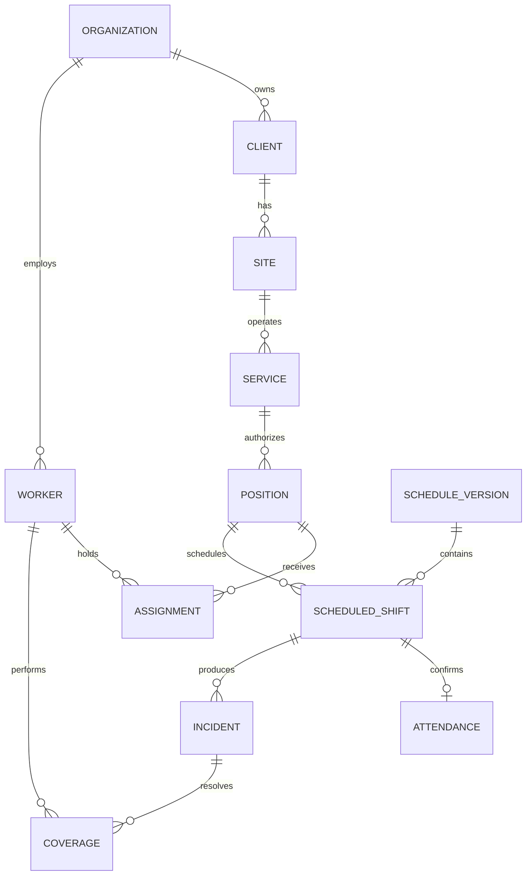

# Bosquejo evolutivo del modelo de datos

## Estado del documento

Este es un modelo conceptual y lógico de trabajo; no es todavía el diccionario físico definitivo ni autoriza crear todas las tablas descritas. SQL Server está confirmado, pero las nomenclaturas, límites de módulos, columnas y algunas relaciones requieren validación funcional.

### Confirmado

- Motor Microsoft SQL Server y acceso mediante EF Core 10.
- Identificadores técnicos que no dependan de nombres visibles.
- Aislamiento de datos por empresa u organización.
- Auditoría de correcciones y trazabilidad de origen.
- Conservación histórica de asignaciones, turnos y cambios operativos.
- Separación entre datos transaccionales y proyecciones de reportes.

### Provisional

- `Company`, `Client`, `Service`, `Position` y demás nombres en inglés son nombres de código de trabajo.
- `GestIA_Dev` es sólo el nombre de la base local.
- Los esquemas y tablas listados pueden renombrarse, dividirse o consolidarse.
- Catálogos, estados, obligatoriedad, longitudes y reglas de unicidad aún deben confirmarse.
- No existe una migración inicial de negocio hasta validar el primer corte vertical.

## Convenciones propuestas para SQL Server

| Concepto | Tipo o estrategia propuesta |
| --- | --- |
| Identificador | `uniqueidentifier`, generado por la aplicación |
| Fecha de negocio | `date` |
| Instante | `datetime2(7)` en UTC |
| Texto | `nvarchar(n)` con longitud explícita |
| Importe | `decimal(19,4)`; escala por confirmar por caso |
| Duración/horas | `decimal(9,4)` o intervalo derivado; validar por módulo |
| Concurrencia | `rowversion` |
| Datos flexibles auditables | JSON en `nvarchar(max)` sólo con justificación |
| Borrado | Desactivación para maestros; histórico para operación |

Los nombres físicos usarán Fluent API. No dependeremos de convenciones implícitas de EF Core para elementos críticos como esquema, tabla, longitud, precisión, índice o relación.

Campos transversales candidatos, sujetos a validación:

```text
Id uniqueidentifier PK
CompanyId uniqueidentifier        -- cuando aplique aislamiento
CreatedAtUtc datetime2(7)
CreatedBy uniqueidentifier
UpdatedAtUtc datetime2(7) null
UpdatedBy uniqueidentifier null
Version rowversion
```

## Áreas conceptuales de etapa 1

Los siguientes nombres describen responsabilidades, no tablas aprobadas.

### Plataforma

- Organización o empresa, zonas y configuración.
- Usuarios, membresías, roles y permisos.
- Eventos de auditoría y mensajes de integración pendientes.

### Comercial

- Clientes, sedes y contactos.
- Solicitudes de servicio y servicios aceptados.
- Reglas generales y vigencias comerciales necesarias para operación.

### Personal

- Personas o empleados, perfiles, estatus y disponibilidad.
- Asignación de perfiles y requisitos con vigencia.

### Operación

- Posiciones autorizadas independientemente de quién las cubra.
- Patrones y segmentos de turno.
- Asignaciones con vigencia e histórico.
- Semanas o periodos planeados versionados.
- Turnos programados, asistencia, incidencias, coberturas y evidencias.

### Información

- Resúmenes diarios y de cobertura reconstruibles.
- Personal efectivo por servicio e intervalo.
- Vistas o tablas de lectura que nunca sean la fuente transaccional.

## Relaciones de trabajo



## Restricciones candidatas

- Unicidad de identificadores de negocio dentro de la organización correspondiente.
- No traslapar asignaciones incompatibles para una misma posición o persona.
- Una versión publicada de planeación no se edita; se reemplaza.
- Una asistencia principal confirmada por turno programado.
- Una cobertura confirmada exige sustituto e intervalo válidos.
- Toda corrección operativa conserva antes, después, motivo, actor y fecha.
- Toda consulta multiempresa aplica el alcance autorizado desde el servidor.

## Primera materialización recomendada

La primera migración se creará únicamente cuando esté validado un corte pequeño de extremo a extremo. El candidato es:

1. Organización/empresa mínima.
2. Cliente y sede mínimos.
3. Empleado o persona operativa mínima.
4. Auditoría y aislamiento requeridos por esas operaciones.

Antes de generarla se debe aprobar el glosario, las claves de negocio, datos obligatorios, longitudes, índices y reglas de eliminación. El proceso está definido en `07-model-evolution.md`.
