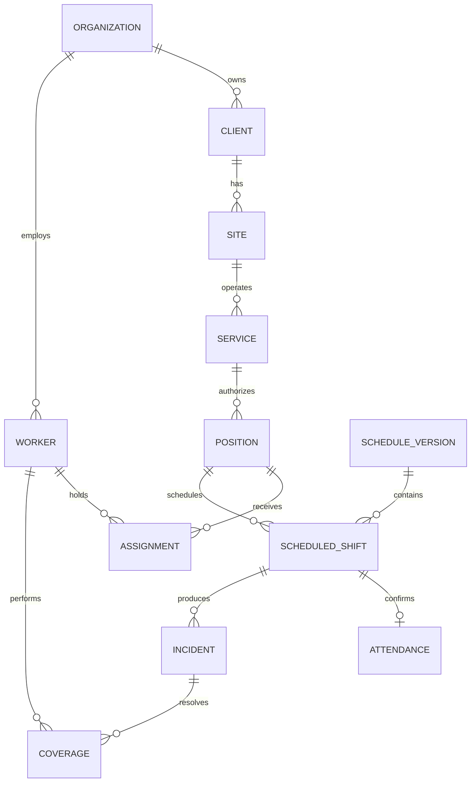

# Bosquejo evolutivo del modelo de datos

## Estado del documento

Este es un modelo conceptual y lógico de trabajo; no es todavía el diccionario físico definitivo ni autoriza crear todas las tablas descritas. SQL Server está confirmado, pero las nomenclaturas, límites de módulos, columnas y algunas relaciones requieren validación funcional.

### Confirmado

- Motor Microsoft SQL Server y acceso mediante EF Core 10.
- Identificadores técnicos que no dependan de nombres visibles.
- Aislamiento de datos por empresa u organización.
- Auditoría de correcciones y trazabilidad de origen.
- Conservación histórica de asignaciones, turnos y cambios operativos.
- Separación entre datos transaccionales y proyecciones de reportes.

### Provisional

- `Company`, `Client`, `Service`, `Position` y demás nombres en inglés son nombres de código de trabajo.
- La base local se llama `db-gestia-dev`; los demás ambientes siguen `db-gestia-{ambiente}`.
- Los esquemas y tablas listados pueden renombrarse, dividirse o consolidarse.
- Catálogos, estados, obligatoriedad, longitudes y reglas de unicidad aún deben confirmarse.
- Existe una primera migración del corte aprobado; los módulos y campos restantes siguen pendientes de validación.

## Convenciones obligatorias para SQL Server

| Concepto | Tipo o estrategia propuesta |
| --- | --- |
| Identificador | `uniqueidentifier`, generado por la aplicación |
| Fecha de negocio | `date` |
| Instante | `datetime2(0)` en UTC |
| Texto | `nvarchar(n)` con longitud explícita |
| Importe | `decimal(19,4)`; escala por confirmar por caso |
| Duración/horas | `decimal(9,4)` o intervalo derivado; validar por módulo |
| Concurrencia | `rowversion` |
| Datos flexibles auditables | JSON en `nvarchar(max)` sólo con justificación |
| Borrado lógico | `Active bit NOT NULL` con valor predeterminado `1` |

Los nombres físicos usarán Fluent API y las reglas ejecutables de `GestIaDatabaseStandards`. No dependeremos de convenciones implícitas de EF Core para elementos críticos como esquema, tabla, columna, longitud, precisión, índice o relación. La especificación normativa está en `docs/database/DATABASE_STANDARDS.md`.

Campos transversales candidatos, sujetos a validación:

```text
Id{Entidad} uniqueidentifier PK
IdOrganization uniqueidentifier   -- cuando aplique aislamiento
CreatedAt datetime2(0)
CreatedBy uniqueidentifier
CreatedByName nvarchar(100)
UpdatedAt datetime2(0) null
UpdatedBy uniqueidentifier null
UpdatedByName nvarchar(100) null
Active bit NOT NULL DEFAULT (1)
Version rowversion
```

Aunque el sufijo físico es `At`, todos los instantes de auditoría se interpretan y almacenan en UTC; `CreatedAt` usa `SYSUTCDATETIME()` como valor predeterminado.

## Primer corte físico

Con la evidencia del contrato, la carta de inicio y la ficha técnica se aprobó un primer corte de 11 tablas: `Organizations`, `Clients`, `ClientSites`, `ClientContacts`, `ServiceContracts`, `Services`, `ServiceConfigurations`, `Employees`, `EmployeeDocuments`, `EmployeeEvaluations` y `ServiceAssignments`.

El mapeo de fuentes, decisiones, datos sensibles y elementos diferidos se encuentra en `08-source-model-analysis.md`. Este corte permite comenzar el desarrollo sin afirmar todavía que turnos, posiciones, reclutamiento completo o expediente del cliente estén terminados.

## Áreas conceptuales posteriores

Los siguientes nombres describen responsabilidades, no tablas aprobadas.

### Plataforma

- Organización o empresa, zonas y configuración.
- Usuarios, membresías, roles y permisos.
- Eventos de auditoría y mensajes de integración pendientes.

### Comercial

- Clientes, sedes y contactos.
- Solicitudes de servicio y servicios aceptados.
- Reglas generales y vigencias comerciales necesarias para operación.

### Personal

- Personas o empleados, perfiles, estatus y disponibilidad.
- Asignación de perfiles y requisitos con vigencia.

### Operación

- Posiciones autorizadas independientemente de quién las cubra.
- Patrones y segmentos de turno.
- Asignaciones con vigencia e histórico.
- Semanas o periodos planeados versionados.
- Turnos programados, asistencia, incidencias, coberturas y evidencias.

### Información

- Resúmenes diarios y de cobertura reconstruibles.
- Personal efectivo por servicio e intervalo.
- Vistas o tablas de lectura que nunca sean la fuente transaccional.

## Relaciones de trabajo



## Restricciones candidatas

- Unicidad de identificadores de negocio dentro de la organización correspondiente.
- No traslapar asignaciones incompatibles para una misma posición o persona.
- Una versión publicada de planeación no se edita; se reemplaza.
- Una asistencia principal confirmada por turno programado.
- Una cobertura confirmada exige sustituto e intervalo válidos.
- Toda corrección operativa conserva antes, después, motivo, actor y fecha.
- Toda consulta multiempresa aplica el alcance autorizado desde el servidor.

## Primera materialización implementada

La primera migración materializa el corte pequeño confirmado por las fuentes:

1. Organización/empresa mínima.
2. Cliente, contactos y sedes.
3. Contrato, servicio y configuración con vigencia.
4. Empleado, documentos, evaluaciones y asignación a servicio.
5. Auditoría, borrado lógico e índices de aislamiento.

Los elementos diferidos sólo se incorporarán en migraciones posteriores después de validar el glosario, privacidad, obligatoriedad, catálogos y ciclo de vida. El proceso está definido en `07-model-evolution.md`.
